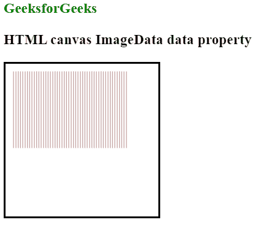

# HTML |画布 ImageData 数据属性

> 原文:[https://www . geesforgeks . org/html-canvas-imagedata-data-property/](https://www.geeksforgeeks.org/html-canvas-imagedata-data-property/)

**ImageData data** 属性用于返回包含指定 ImageData 对象的图像数据的对象。
图像数据对象中的每个像素包含四条信息，即 RGBA 值:

*   r 表示红色(0-255)
*   g 表示绿色(0-255)
*   b 表示蓝色(0-255)
*   a 表示 alpha 通道(0-255；0 是完全透明的，255 是完全可见的)

存储在 ImageData 对象的 data 属性中的数组存储颜色/alpha 的信息。
**语法:**

```html
imageData.data;
```

**例:**

## 超文本标记语言

```html
<!DOCTYPE html>
<html>

<body>
    <h3 style="color:green">
      GeeksforGeeks
  </h3>
    <h3>HTML canvas ImageData data property</h3>
    <canvas id="myCanvas"
            width="200"
            height="200"
            style="border:2px solid ;">
  </canvas>
    <p id=g eeks></p>

    <script>
        var can = document.getElementById("myCanvas");
        var gfg = can.getContext("2d");
        var imgData = gfg.createImageData(150, 100);

        var i;
        for (i = 0; i < imgData.data.length; i += 3) {
            imgData.data[i + 0] = 100;
            imgData.data[i + 1] = 0;
            imgData.data[i + 2] = 0;
        }

        gfg.putImageData(imgData, 10, 10);
    </script>

</body>

</html>
```

**输出:**



**支持的浏览器:**支持的浏览器 **HTML 画布 ImageData 数据属性**如下:

*   铬
*   Internet Explorer 9.0
*   旅行队
*   火狐浏览器
*   歌剧