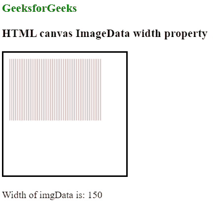

# HTML |画布图像数据宽度属性

> 原文:[https://www . geesforgeks . org/html-canvas-imagedata-width-property/](https://www.geeksforgeeks.org/html-canvas-imagedata-width-property/)

**图像数据宽度**属性用于返回图像数据对象的宽度，以像素为单位。

**语法:**

```html
imgData.width;

```

**示例:**

```html
<!DOCTYPE html>
<html>

<body>
    <h3 style="color:green">GeeksforGeeks</h3>
    <h3>HTML canvas ImageData width property</h3>
    <canvas id="myCanvas"
            width="200" 
            height="200"
            style="border:2px solid ;">
  </canvas>
    <p id=g eeks></p>
    <script>
        var can = document.getElementById("myCanvas");
        var gfg = can.getContext("2d");
        var imgData = gfg.createImageData(150, 100);

        var i;
        for (i = 0; i < imgData.data.length; i += 3) {
            imgData.data[i + 0] = 100;
            imgData.data[i + 1] = 0;
            imgData.data[i + 2] = 0;
        }

        gfg.putImageData(imgData, 10, 10);

        document.getElementById("geeks").innerHTML =
            "Width of imgData is: " + imgData.width
    </script>

</body>

</html>
```

**输出:**


**支持的浏览器:**

*   铬
*   Internet Explorer 9.0
*   旅行队
*   火狐浏览器
*   歌剧