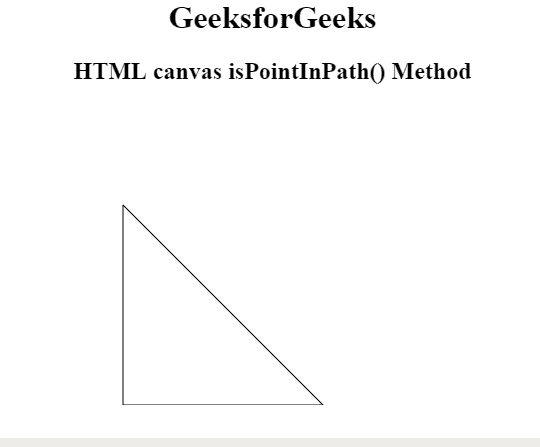
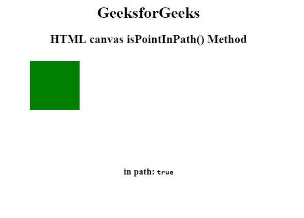
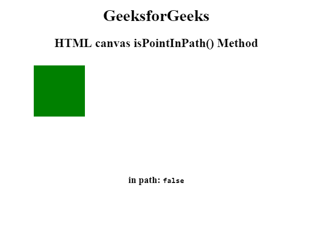

# HTML |画布 isPointInPath()方法

> 原文:[https://www . geesforgeks . org/html-canvas-ispointinpath-method/](https://www.geeksforgeeks.org/html-canvas-ispointinpath-method/)

**画布 isPointInPath()方法**用于检查指定点是否包含在当前路径中。如果指定的点在当前路径中，则 isPointInPath()方法返回 true，否则返回 false。

**语法:**

```html
context.isPointInPath( x, y );
```

**参数:**该方法接受两个参数，如上所述，如下所述:

*   **x:** 此参数指定要检查的 x 轴坐标点。
*   **y:** :此参数指定要检查的 y 轴坐标点。

**示例 1:** 如果点(150，150)在路径中，将绘制三角形。

```html
<!DOCTYPE html>
<html>

<head>
    <title>
        HTML canvas isPointInPath() Method
    </title>
</head>

<body style="text-align:center;">

    <h1>GeeksforGeeks</h1>

    <h2>HTML canvas isPointInPath() Method</h2>

    <canvas id="GFG" width="500" height="300" >
    </canvas>

    <script>
        var doc_id = document.getElementById("GFG");
        var context = doc_id.getContext("2d");

        context.beginPath();
        context.moveTo(100, 100);
        context.lineTo(100, 300);
        context.lineTo(300, 300);
        context.closePath();

        if (context.isPointInPath(150, 150)) {
            context.stroke();
        };
    </script>
</body>

</html>    
```



**示例 2:** 当点在路径中时，返回布尔值 true。

```html
<!DOCTYPE html>
<html>

<head>
    <title>
        HTML canvas isPointInPath() Method
    </title>
</head>

<body style="text-align:center;">

    <h1>GeeksforGeeks</h1>

    <h2>HTML canvas isPointInPath() Method</h2>

    <canvas id="GFG" width="500" height="300" >
    </canvas>

    <h3>
        in path: <code id="result">false</code>
    </h3>

    <script>
        var doc_id = document.getElementById('GFG');
        var context = doc_id.getContext('2d');
        var result = document.getElementById('result');
        context.rect(10, 10, 100, 100);
        context.fillStyle = 'green';
        context.fill();
        result.innerText = context.isPointInPath(10, 70);
    </script>
</body>

</html>             
```



**示例 3:** 当点不在路径中时，返回布尔值 false。

```html
<!DOCTYPE html>
<html>

<head>
    <title>
        HTML canvas isPointInPath() Method
    </title>
</head>

<body style="text-align:center;">

    <h1>GeeksforGeeks</h1>

    <h2>HTML canvas isPointInPath() Method</h2>

    <canvas id="GFG" width="500" height="300" >
    </canvas>

    <h3>
        in path: <code id="result">false</code>
    </h3>

    <script>
        var doc_id = document.getElementById('GFG');
        var context = doc_id.getContext('2d');
        var result = document.getElementById('result');
        context.rect(10, 10, 100, 100);
        context.fillStyle = 'green';
        context.fill();
        result.innerText = context.isPointInPath(110, 170);
    </script>
</body>

</html>              
```



**支持的浏览器:**canvas isPointInPath()方法支持的浏览器如下:

*   谷歌 Chrome
*   Internet Explorer 9.0
*   火狐浏览器
*   旅行队
*   歌剧