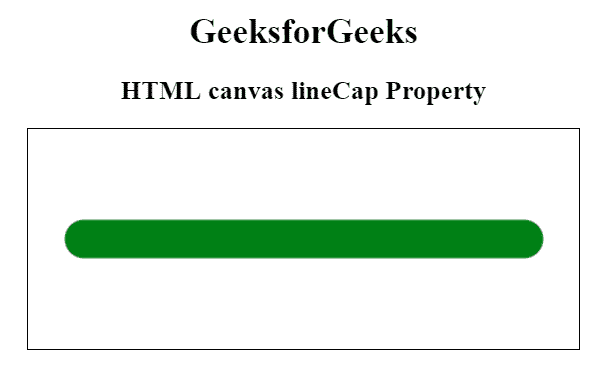
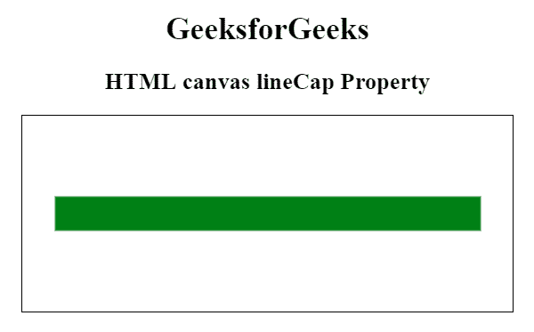

# HTML |画布行帽属性

> 原文:[https://www.geeksforgeeks.org/html-canvas-linecap-property/](https://www.geeksforgeeks.org/html-canvas-linecap-property/)

canvas lineCap 属性用于设置或返回线条端点的样式。线条可以有三种帽型之一:**对接**、**圆形**或**方形**。canvas lineCap 属性的默认值是 butt。在调用 stroke()函数之前，必须设置 lineCap 属性。

**语法:**

```html
context.lineCap = "butt|round|square";
```

**属性值:**

*   **对接:**为默认样式。此属性值会将线条两端的平边相加。
*   **round:** 该属性值将在该行的每一端添加端盖。
*   **方形:**该属性值将线条两端的方形帽相加。

**注:**数值**圆****方**使线略长。

**示例 1:** 此示例说明了 butt 属性值。

```html
<!DOCTYPE html>
<html>

<head>
    <title>
        HTML canvas lineCap Property
    </title>
</head>

<body style="text-align:center;">

    <h1>GeeksforGeeks</h1>

    <h2>HTML canvas lineCap Property</h2>

    <canvas id="GFG" width="500" height="200"
        style="border:1px solid black;">
    </canvas>

    <script>
        var canvas_id = document.getElementById("GFG");
        var context = canvas_id.getContext("2d");

        context.beginPath();
        context.lineWidth = 35;
        context.lineCap = "butt";
        context.moveTo(50, 100);
        context.lineTo(450, 100);
        context.strokeStyle ="green";
        context.stroke();
    </script>
</body>

</html>                    
```

**输出:**


**示例 2:** 此示例说明了倒圆角属性值。

```html
<!DOCTYPE html>
<html>

<head>
    <title>
        HTML canvas lineCap Property
    </title>
</head>

<body style="text-align:center;">

    <h1>GeeksforGeeks</h1>

    <h2>HTML canvas lineCap Property</h2>

    <canvas id="GFG" width="500" height="200"
        style="border:1px solid black;">
    </canvas>

    <script>
        var canvas_id = document.getElementById("GFG");
        var context = canvas_id.getContext("2d");

        context.beginPath();
        context.lineWidth = 35;
        context.lineCap = "round";
        context.moveTo(50, 100);
        context.lineTo(450, 100);
        context.strokeStyle ="green";
        context.stroke();
    </script>
</body>

</html>                    
```

**输出:**


**示例 3:** 本示例说明了平方属性值。

```html
<!DOCTYPE html>
<html>

<head>
    <title>
        HTML canvas lineCap Property
    </title>
</head>

<body style="text-align:center;">

    <h1>GeeksforGeeks</h1>

    <h2>HTML canvas lineCap Property</h2>

    <canvas id="GFG" width="500" height="200"
        style="border:1px solid black;">
    </canvas>

    <script>
        var canvas_id = document.getElementById("GFG");
        var context = canvas_id.getContext("2d");

        context.beginPath();
        context.lineWidth = 35;
        context.lineCap = "square";
        context.moveTo(50, 100);
        context.lineTo(450, 100);
        context.strokeStyle ="green";
        context.stroke();
    </script>
</body>

</html>                    
```

**输出:**
