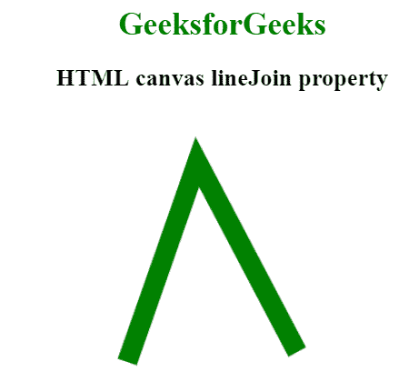
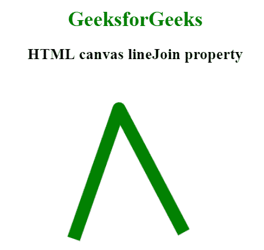

# HTML |画布线条连接属性

> 原文:[https://www . geesforgeks . org/html-canvas-line join-property/](https://www.geeksforgeeks.org/html-canvas-linejoin-property/)

HTML 画布 lineJoin 属性用于设置或返回当两条线相交时，通过使用 lineJoin 属性创建的角的类型。连接类型可以有三种样式之一:斜角、圆角或斜接。但是，连接样式通常具有斜接样式。

**语法:**

```html
context.lineJoin = "bevel|round|miter";
```

**属性值:**

*   **斜接:**为默认样式。该值用于设计尖角。
*   **斜角:**此设计用于创建斜角。
*   **圆形:**这个设计是用来打造圆角的。

**示例 1:** 此示例说明了斜接线连接属性。

```html
<!DOCTYPE html>
<html>

<head> 
    <title> 
        HTML canvas lineJoin property
    </title> 
</head> 

<body style="text-align:center;">

    <h1 style="color:green"> 
        GeeksforGeeks 
    </h1> 

    <h2> 
        HTML canvas lineJoin property
    </h2> 

    <canvas id="canvas" width="350" height="380"></canvas>

    <script>
        var can = document.getElementById("canvas");
        var context = can.getContext("2d");
        context.beginPath();
        context.lineWidth = 20;
        context.lineJoin = "miter";
        context.moveTo(80, 250);
        context.lineTo(150, 50);
        context.lineTo(250, 240);
        context.strokeStyle ="green";
        context.stroke();
    </script>
</body>

</html>                    
```

**输出:**


**示例 2:** 此示例说明了斜面线连接属性。

```html
<!DOCTYPE html>
<html>

<head> 
    <title> 
        HTML canvas lineJoin property
    </title> 
</head> 

<body style="text-align:center;">

    <h1 style="color:green"> 
        GeeksforGeeks 
    </h1> 

    <h2> 
        HTML canvas lineJoin property
    </h2> 

    <canvas id="canvas" width="350" height="380"></canvas>

    <script>
        var can = document.getElementById("canvas");
        var context = can.getContext("2d");
        context.beginPath();
        context.lineWidth = 20;
        context.lineJoin = "bevel";
        context.moveTo(80, 250);
        context.lineTo(150, 50);
        context.lineTo(250, 240);
        context.strokeStyle ="green";
        context.stroke();
    </script>
</body>

</html>                    
```

**输出:**


**示例 3:** 此示例说明了 round linejoin 属性。

```html
<!DOCTYPE html>
<html>

<head> 
    <title> 
        HTML canvas lineJoin property
    </title> 
</head> 

<body style="text-align:center;">

    <h1 style="color:green"> 
        GeeksforGeeks 
    </h1> 

    <h2> 
        HTML canvas lineJoin property
    </h2> 

    <canvas id="canvas" width="350" height="380"></canvas>

    <script>
        var can = document.getElementById("canvas");
        var context = can.getContext("2d");
        context.beginPath();
        context.lineWidth = 20;
        context.lineJoin = "round";
        context.moveTo(80, 250);
        context.lineTo(150, 50);
        context.lineTo(250, 240);
        context.strokeStyle ="green";
        context.stroke();
    </script>
</body>

</html>                    
```

**输出:**


**支持的浏览器:**HTML 画布 lineJoin 属性支持的浏览器如下:

*   谷歌 Chrome
*   Internet Explorer 9.0
*   火狐浏览器
*   旅行队
*   歌剧