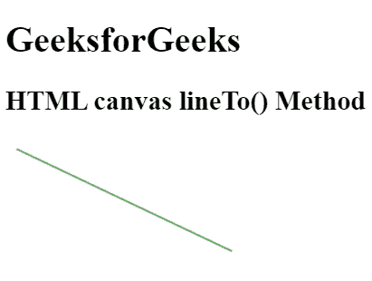

# HTML |画布 lineTo()方法

> 原文:[https://www.geeksforgeeks.org/html-canvas-lineto-method/](https://www.geeksforgeeks.org/html-canvas-lineto-method/)

**lineTo()方法**用于添加一个新点，创建一条从该点到画布中最后一个指定点的直线，

**语法:**

```html
context.lineTo(x, y);
```

**参数:**

*   **x:** 此参数指定从何处创建直线的 x 坐标。
*   **y:** 此参数指定从何处创建直线的 y 坐标。

**例 1:**

```html
<!DOCTYPE html>
<html>

<head>
    <title>
        HTML canvas lineTo() Method
    </title>
</head>

<body style="text-align:left;">

    <h1>GeeksforGeeks</h1>

    <h2>HTML canvas lineTo() Method</h2>

    <canvas id="GFG" width="500" height="200">
    </canvas>

    <script>
        var doc_id = document.getElementById("GFG");
        var context = doc_id.getContext("2d");
        context.beginPath();
        context.moveTo(10, 10);
        context.strokeStyle = 'green';
        context.lineTo(200, 100);
        context.stroke();
    </script>
</body>

</html>
```

**输出:**


**支持的浏览器:**下面列出了 **HTML 画布 lineTo()方法**支持的浏览器:

*   谷歌 Chrome 4.0
*   Internet Explorer 9.0
*   Firefox 3.6
*   Safari 4.0
*   歌剧 10.1