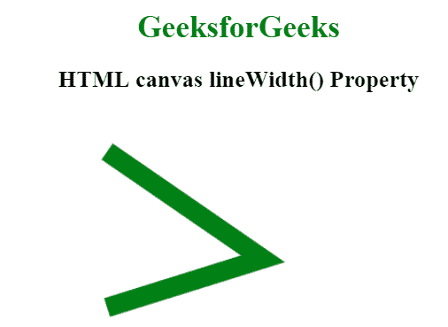
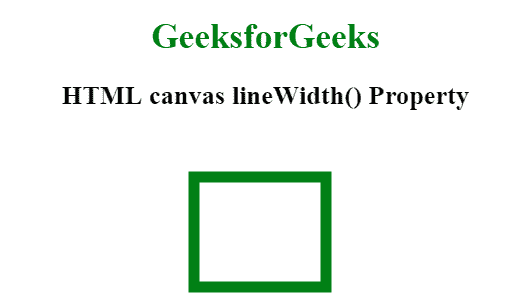

# HTML |画布线宽属性

> 原文:[https://www . geesforgeks . org/html-canvas-line width-property/](https://www.geeksforgeeks.org/html-canvas-linewidth-property/)

HTML 画布线宽属性用于设置或返回线条的宽度(线条的粗细)。线条的宽度以像素为单位设置。此属性的默认值为 1。

**语法:**

```html
context.lineWidth = number;
```

**属性值:**

*   **数字:**该属性值表示以像素为单位指定线宽的数字。该属性忽略*零*、*负*、*无穷大*和 *NaN* 值。

**例 1:**

```html
<!DOCTYPE html>
<html>

<head> 
    <title> 
        HTML canvas lineWidth Property
    </title> 
</head> 

<body style = "text-align:center;">

    <h1 style="color:green"> 
        GeeksforGeeks 
    </h1> 

    <h2> 
        HTML canvas lineWidth() Property 
    </h2> 

    <canvas id="canvas" width="350" height="380"></canvas>

    <script>
        var canv = document.getElementById("canvas");
        var context = canv.getContext("2d");
        context.beginPath();
        context.lineWidth = 20;
        context.moveTo(40, 40);
        context.lineTo(200, 150);
        context.lineTo(40, 200);
        context.strokeStyle = "green";
        context.stroke();
    </script>
</body>

</html>                    
```

**输出:**


**程序 2:**

```html
<!DOCTYPE html>
<html>

<head> 
    <title> 
        HTML canvas lineWidth Property
    </title> 
</head> 

<body style = "text-align:center;">

    <h1 style="color:green"> 
        GeeksforGeeks 
    </h1> 

    <h2> 
        HTML canvas lineWidth() Property 
    </h2> 

    <canvas id="canvas" width="350" height="380"></canvas>

    <script>
        var canv = document.getElementById("canvas");
        var context = canv.getContext("2d");
        context.beginPath();
        context.lineWidth = 10;
        context.strokeStyle ="green";
        context.strokeRect(110, 40, 120, 100);
    </script>
</body>

</html>                    
```

**输出:**


**支持的浏览器:**HTML 画布线宽属性支持的浏览器如下:

*   谷歌 Chrome
*   Internet Explorer 9.0
*   火狐浏览器
*   旅行队
*   歌剧