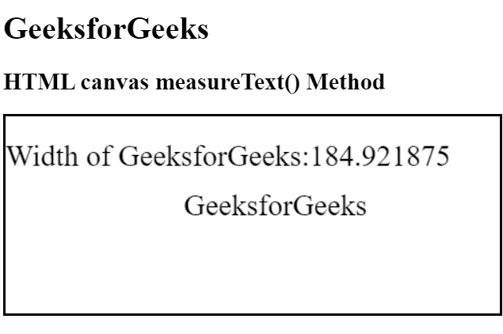

# HTML |画布 measureText()方法

> 原文:[https://www . geesforgeks . org/html-canvas-measure text-method/](https://www.geeksforgeeks.org/html-canvas-measuretext-method/)

**measureText()方法**用于返回一个以像素为单位表示指定文本宽度的对象。这个方法可以用来在画布上书写之前获取文本的宽度。

**语法:**

```html
context.measureText(text).width;
```

**参数:**

*   **文本:**此参数指定要测量的文本。

**示例:**

```html
<!DOCTYPE html>
<html>

<head>
    <title>
        HTML canvas measureText() Method
    </title>
</head>

<body style="text-align:left;">

    <h1>GeeksforGeeks</h1>

    <h2>HTML canvas measureText() Method</h2>

    <canvas id="GFG" width="500" height="200" style="border:2px solid">
    </canvas>

    <script>
        var doc_id = document.getElementById("GFG");
        var context = doc_id.getContext("2d");
        context.font = "30px solid";
        var txt = "GeeksforGeeks"
        context.fillText(txt, 180, 100);
        context.fillText("Width of GeeksforGeeks:" +
            context.measureText(txt).width, 0, 50);
    </script>
</body>

</html>
```

**输出:**


**支持的浏览器:**下面列出了 **HTML 画布 measureText()方法**支持的浏览器:

*   谷歌 Chrome
*   Internet Explorer 9.0
*   火狐浏览器
*   旅行队
*   歌剧