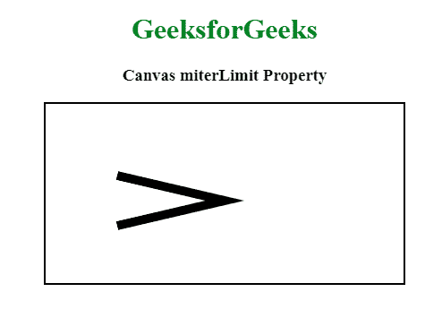

# HTML |画布 miterLimit 属性

> 原文:[https://www . geesforgeks . org/html-canvas-miterlimit-property/](https://www.geeksforgeeks.org/html-canvas-miterlimit-property/)

**斜接长度属性**用于或返回最大斜接长度。它用于防止斜接长度过长。
斜接长度是两条直线相交的内角和外角之间的距离。

**语法:**

```html
context.miterLimit = number;
```

**属性值:**

*   **数字:**是正数，表示最大斜接长度。

**示例:**

```html
<!DOCTYPE html>
<html>

<body>
    <center>
        <h1 style="color:green"> GeeksforGeeks </h1>
        <h3>Canvas miterLimit Property</h3>
        <canvas id="gfgCanvas" 
                width="400"
                height="200" 
                style="border:2px solid ">
        </canvas>

        <script>
            var gfg = document.getElementById("gfgCanvas");
            var context = gfg.getContext("2d");
            context.lineWidth = 10;
            context.lineJoin = "miter";
            context.miterLimit = 5;
            context.moveTo(80, 80);
            context.lineTo(200, 108);
            context.lineTo(80, 136);
            context.stroke();
        </script>
    </center>

</body>

</html>
```

**输出:**


**支持的浏览器:****HTML 画布 miterLimit Property** 支持的浏览器如下:

*   谷歌 Chrome
*   微软公司出品的 web 浏览器
*   火狐浏览器
*   苹果 Safari
*   歌剧