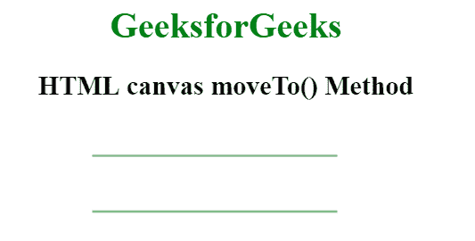

# HTML |画布 moveTo()方法

> 原文:[https://www.geeksforgeeks.org/html-canvas-moveto-method/](https://www.geeksforgeeks.org/html-canvas-moveto-method/)

canvas moveTo()方法用于将路径移动到画布中的指定点，而不创建线条。调用 moveTo()方法后，我们可以使用 stroke()方法在画布上绘制路径。

**语法:**

```html
context.moveTo( x, y );
```

**参数:**该函数接受两个参数，如上所述，如下所述:

*   **x:** 此参数指定点的 x 轴(水平)坐标。
*   **y:** 该参数指定到点的 y 轴(垂直)坐标。

**程序 1:**

```html
<!DOCTYPE html>
<html>

<head>
    <title>
        HTML canvas moveTo() Method
    </title>
</head>

<body style="text-align:center;">

    <h1 style="color:green;">
        GeeksforGeeks
    </h1>

    <h2>HTML canvas moveTo() Method</h2>

    <canvas id="GFG" width="500" height="300" >
    </canvas>

    <script>
        var id_cont = document.getElementById("GFG");
        var context = id_cont.getContext("2d");
        context.moveTo(50, 50);
        context.lineTo(450, 50);
        context.strokeStyle="green";
        context.stroke();
    </script>
</body>

</html>                    
```

**输出:**


**程序 2:**

```html
<!DOCTYPE html>
<html>

<head>
    <title>
        HTML canvas moveTo() Method
    </title>
</head>

<body style="text-align:center;">

    <h1 style="color:green;">
        GeeksforGeeks
    </h1>

    <h2>HTML canvas moveTo() Method</h2>

    <canvas id="GFG" width="500" height="300" >
    </canvas>

    <script>
        var id_cont = document.getElementById("GFG");
        var context = id_cont.getContext("2d");

        // Begin the second sub-path
        context.moveTo(130, 80);   
        context.lineTo(350, 80);

        // Begin the second sub-path
        context.moveTo(130, 30);   
        context.lineTo(350, 30);
        context.strokeStyle="green";
        context.stroke();
    </script>
</body>

</html>    
```

**输出:**


**支持的浏览器:**HTML 画布 moveTo()方法支持的浏览器如下:

*   谷歌 Chrome
*   Internet Explorer 9.0
*   火狐浏览器
*   歌剧
*   旅行队