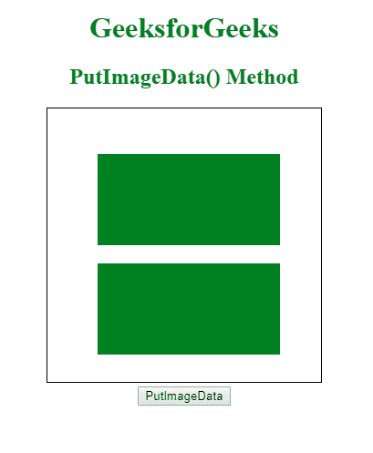

# HTML |画布 putImageData()方法

> 原文:[https://www . geesforgeks . org/html-canvas-putimagedata-method/](https://www.geeksforgeeks.org/html-canvas-putimagedata-method/)

**putImageData()方法**用于将图像数据从指定的 ImageData 对象放回画布。

**语法:**

```html
context.putImageData(imgData, x, y, dirtyX, dirtyY, dirtyWidth, dirtyHeight);
```

**参数值:**

*   **imgData:** 用于指定要放回画布的 ImageData 对象。
*   **x:** 是 ImageData 对象左上角的 x 坐标。它以像素为单位。
*   **y:** 是 ImageData 对象左上角的 y 坐标。它以像素为单位。
*   **dirtyX:** 是水平(x)值，表示图像在画布上的位置。它以像素为单位，是可选的。
*   **dirtyY:** 垂直(y)值表示图像在画布上的位置。它以像素为单位，是可选的。
*   **dirtyWidth:** 是在画布上绘制图像所用的宽度。它也是可选的。
*   **dirty h8:**是用来在画布上绘制图像的高度。它也是可选的。

**示例:**

```html
<!DOCTYPE html>
<html>

<body>
    <center>
        <h1 style="color:green;">GeeksforGeeks</h1>
        <h2 style="color:green;">PutImageData() Method</h2>
        <canvas id="gfgCanvas" 
                width="300" 
                height="300" 
                style="border:1px solid ;">
        </canvas>

        <script>
            var gfg = document.getElementById("gfgCanvas");
            var context = gfg.getContext("2d");
            context.fillStyle = "green";
            context.fillRect(55, 50, 200, 100);

            function putImage() {
                // getImageData is used to copy the pixels
                var imageData = context.getImageData(55, 50, 200, 100);
                context.putImageData(imageData, 55, 170);
            }
        </script>
        <br>
        <button onclick="putImage()">PutImageData</button>
    </center>
</body>

</html>
```

**输出:**
**点击前:**


**点击后:**


**支持的浏览器:**以下是 **HTML 画布 putImageData()方法**支持的浏览器:

*   铬
*   Mozilla Firefox
*   Internet Explorer 9.0
*   歌剧
*   旅行队