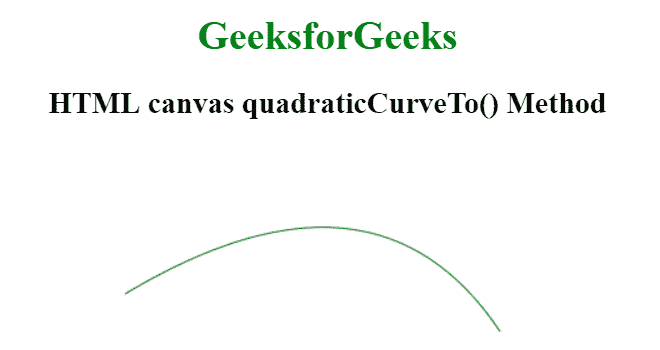
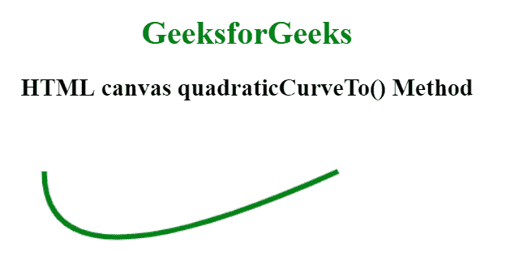

# HTML |画布 quadraticCurveTo()方法

> 原文:[https://www . geeksforgeeks . org/html-canvas-quadraticucerveto-method/](https://www.geeksforgeeks.org/html-canvas-quadraticcurveto-method/)

画布 quadraticCurveTo()方法用于在画布上创建二次曲线。该方法通过使用表示二次参数曲线的指定控制点向当前路径添加一个点。

**语法:**

```html
context.quadraticCurveTo( cx, cy, x, y );
```

**参数:**

*   **cx:** 此参数保存二次控制点的 x 坐标。
*   **cy:** 此参数保存二次控制点的 y 坐标。
*   **x:** 此参数指定终点的 x 坐标。
*   **y:** 此参数指定终点的 y 坐标。

**例 1:**

```html
<!DOCTYPE HTML>
<html>

<head> 
    <title> 
        HTML canvas quadraticCurveTo() Method
    </title> 
</head> 

<body style="text-align:center;"> 

    <h1 style="color:green;">
        GeeksforGeeks
    </h1> 

    <h2>HTML canvas quadraticCurveTo() Method</h2> 

    <canvas id="GFG" width="500" height="300"></canvas> 

    <script>
        var geeks = document.getElementById('GFG');
        var context = geeks.getContext('2d');
        context.beginPath();
        context.moveTo(88, 120);
        context.quadraticCurveTo(288, 0, 388, 150);
        context.strokeStyle = 'green';
        context.stroke();
    </script>
</body> 

</html>                          
```

**输出:**


**例 2** :

```html
<!DOCTYPE HTML>
<html>

<head> 
    <title> 
        HTML canvas quadraticCurveTo() Method
    </title> 
</head> 

<body style="text-align:center;"> 

    <h1 style="color:green;">
        GeeksforGeeks
    </h1> 

    <h2>HTML canvas quadraticCurveTo() Method</h2> 

    <canvas id="GFG" width="500" height="300"></canvas> 

    <script>
        var geeks = document.getElementById('GFG');
        var context = geeks.getContext('2d');
        context.beginPath();
        context.moveTo(50, 50);
        context.quadraticCurveTo(50, 180, 340, 50);
        context.strokeStyle = 'green';
        context.lineWidth = 5;
        context.stroke();
    </script>
</body> 

</html>                              
```

**输出:**


**支持的浏览器:**HTML 画布 quadraticCurveTo()方法支持的浏览器如下:

*   谷歌 Chrome
*   Internet Explorer 9.0
*   火狐浏览器
*   歌剧
*   旅行队