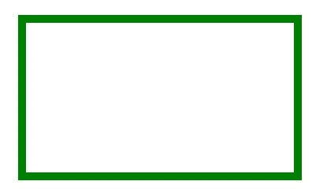
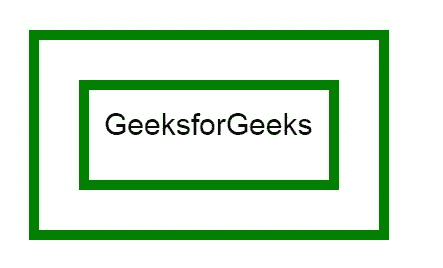

# HTML |画布 rect()方法

> 原文:[https://www.geeksforgeeks.org/html-canvas-rect-method/](https://www.geeksforgeeks.org/html-canvas-rect-method/)

HTML 中的 **rect()** 方法用来*在 HTML* 中创建一个矩形。

**语法:**

```html
context.rect(x, y, width, height)
```

**参数:**

*   **x:** 存储矩形左上角的 x 坐标。
*   **y:** 存储矩形左上角的 y 坐标。
*   **宽度:**以像素为单位存储宽度。
*   **高度:**以像素为单位存储高度。

**示例-1:**

```html
<!DOCTYPE html>
<html>

<head>
    <title>
        HTML canvas rect() Method
    </title>
</head>

<body>
    <canvas id="GFG" 
            width="500" 
            height="300">
  </canvas>

    <script>
        var x = 
            document.getElementById("GFG");
        var contex = 
            x.getContext("2d");

        // Create rectangle
        contex.rect(50, 50, 350, 200);
        contex.strokeStyle = "green";
        contex.lineWidth = "10";
        contex.stroke();
    </script>

</body>

</html>
```

**输出:**


**示例-2:**

```html
<!DOCTYPE html>
<html>

<head>
    <title>
        HTML canvas rect() Method
    </title>
</head>

<body>
    <canvas id="GFG" 
            width="500" 
            height="300">
  </canvas>

    <script>
        var x = 
            document.getElementById("GFG");
        var contex = 
            x.getContext("2d");
        contex.rect(50, 50, 350, 200);

        var x = document.getElementById("GFG");
        var contex = x.getContext("2d");
        contex.rect(100, 100, 250, 100);
        contex.strokeStyle = "green";
        contex.lineWidth = "10";
        contex.font = "30px Arial";
        contex.fillText("GeeksforGeeks", 120, 150);
        contex.stroke();
    </script>
</body>

</html>
```

**输出:**


**支持的浏览器:**

*   谷歌 Chrome
*   Internet Explorer 9.0
*   火狐浏览器
*   旅行队
*   歌剧