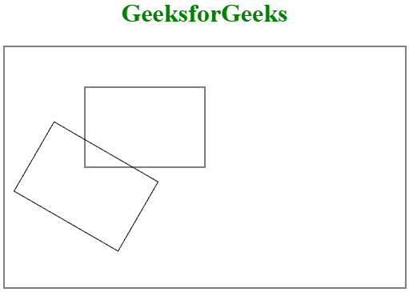
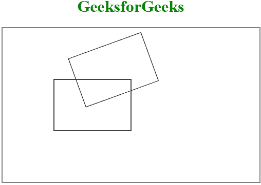

# HTML 画布旋转()方法

> 原文:[https://www.geeksforgeeks.org/html-canvas-rotate-method/](https://www.geeksforgeeks.org/html-canvas-rotate-method/)

**HTML 画布旋转()方法**用于将绘图旋转给定角度。请注意，旋转仅适用于旋转完成后制作的画布。

**语法:**

```html
context.rotate(angle)
```

**参数值:**

*   **角度:**以弧度存储旋转角度。如果角度以度数的形式给出，则使用公式**度数*数学将其转换为弧度。PI/180** 。

**例 1:**

```html
<!DOCTYPE html> 
<html> 

<head> 
    <title> 
        HTML canvas rotate() Method
    </title> 
</head> 

<body> 
<center>
<h1 style="color:green">GeeksforGeeks</h1>
    <canvas id="GFG" width="500"
            height="300" style="border:2px solid gray;"> 
        </canvas> 

    <script> 
        var geeks = document.getElementById("GFG"); 
        var contex = geeks.getContext("2d");
        contex.strokeRect(100, 50, 150, 100); 
        contex.rotate(30 * Math.PI / 180);
        contex.strokeRect(100, 50, 150, 100);
    </script> 
</center>
</body> 

</html>                         
```

**输出:**


**例 2:**

```html
<!DOCTYPE html> 
<html> 

<head> 
    <title> 
        HTML canvas rotate() Method
    </title> 
</head> 

<body> 
<center>
<h1 style="color:green">GeeksforGeeks</h1>
    <canvas id="GFG" width="500"
            height="300" style="border:2px solid gray;"> 
</canvas> 

    <script> 
        var geeks = document.getElementById("GFG"); 
        var contex = geeks.getContext("2d"); 
        contex.rect(100, 100, 150, 100);//acctual rectangle
        contex.stroke(); 

        contex.rotate((-20) * Math.PI / 180);
        contex.rect(100, 100, 150, 100);//rotate rectangle
        contex.stroke();
    </script> 
</center>
</body> 

</html>                                      
```

**输出:**


**支持的浏览器:**

*   谷歌 Chrome
*   Internet Explorer 9.0
*   火狐浏览器
*   旅行队
*   歌剧