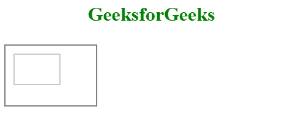

# HTML |画布比例()方法

> 原文:[https://www.geeksforgeeks.org/html-canvas-scale-method/](https://www.geeksforgeeks.org/html-canvas-scale-method/)

**HTML 画布缩放()方法**用于将当前图形缩放成更小或更大的尺寸。缩放图形后，图形的所有特征都会缩放。它必须在画布之前定义。

**语法:**

```html
context.scale( scalewidth, scaleheight )
```

**参数值:**

*   **缩放宽度:**缩放当前绘图的宽度，(1=100%，0.5=50%，2=200%，以此类推)。
*   **缩放高度:**缩放当前绘图的高度，(1=100%，0.5=50%，2=200%，以此类推)

**示例 1:** 本示例使用画布比例()方法增加绘图大小。

```html
<!DOCTYPE html> 
<html> 

<head> 
    <title> 
        HTML canvas scale() Method
    </title> 
</head> 

<body> 
<center>
<h1 style="color:green">GeeksforGeeks</h1>
    <canvas id="GFG"
            width="500"
            height="300"> 
</canvas> 

    <script> 
        var x = 
            document.getElementById("GFG"); 
        var contex = 
            x.getContext("2d"); 
        contex.strokeRect(10, 10, 150, 100); 
        contex.scale(2, 2);
        contex.strokeRect(50, 50, 150, 100);
    </script> 
<center>
</body> 

</html> 
```

**输出:**


**示例 2:** 本示例使用画布比例()方法减小绘图大小。

```html
<!DOCTYPE html> 
<html> 

<head> 
    <title> 
        HTML canvas scale() Method
    </title> 
</head> 

<body> 
<center>
<h1 style="color:green">GeeksforGeeks</h1>
    <canvas id="GFG"
            width="500"
            height="300"> 
</canvas> 

    <script> 
        var x = document.getElementById("GFG"); 
        var contex = x.getContext("2d"); 
        contex.strokeRect(10, 10, 150, 100); 
        contex.scale(0.5, 0.5);
        contex.strokeRect(50, 50, 150, 100);
    </script> 
</center>
</body> 

</html>                    
```

**输出:**


**支持的浏览器:**HTML 画布比例()方法支持的浏览器如下:

*   谷歌 Chrome
*   Internet Explorer 9.0 或更高版本
*   火狐浏览器
*   旅行队
*   歌剧