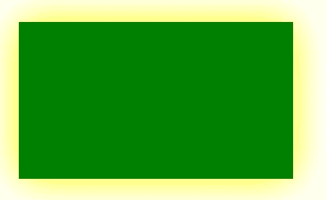
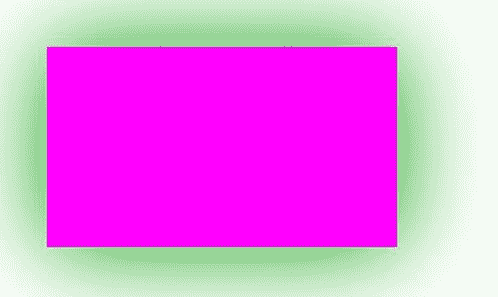

# HTML |画布阴影模糊属性

> 原文:[https://www . geesforgeks . org/html-canvas-shadow blur-property/](https://www.geeksforgeeks.org/html-canvas-shadowblur-property/)

**画布阴影模糊属性**用于**设置**或**返回** *阴影的模糊等级*。

**语法:**

```html
context.shadowBlur=number
```

**属性:**

*   **编号:**用于设置阴影的模糊等级。

**示例-1:**

```html
<!DOCTYPE html>
<html>

<head>
    <title>
        HTML canvas shadowBlur Property
    </title>
</head>

<body>
    <canvas id="GFG"
            width="500"
            height="300">
  </canvas>

    <script>
        var x = document.getElementById("GFG");
        var contex = x.getContext("2d");
        contex.shadowBlur = 50;
        contex.shadowColor = "yellow";
        contex.fillStyle = "green";
        contex.fillRect(50, 50, 350, 200);
        contex.stroke();
    </script>

</body>

</html>
```

**输出:**


**示例-2:**

```html
<!DOCTYPE html>
<html>

<head>
    <title>
        HTML canvas shadowBlur Property
    </title>
</head>

<body>
    <canvas id="GFG" 
            width="500" 
            height="300">
  </canvas>

    <script>
        var x = document.getElementById("GFG");
        var contex = x.getContext("2d");
        contex.shadowBlur = 100;
        contex.shadowColor = "rgb(0, 153, 0)";
        contex.fillStyle = "rgb(255, 0, 255)";
        contex.fillRect(50, 50, 350, 200);
        contex.stroke();
    </script>

</body>

</html>
```

**输出:**


**支持的浏览器:**

*   谷歌 Chrome
*   Internet Explorer 9.0
*   火狐浏览器
*   旅行队
*   歌剧