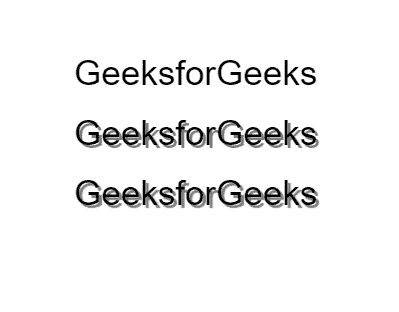
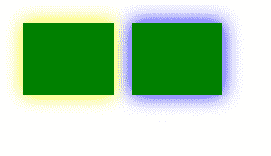

# HTML |画布阴影颜色属性

> 原文:[https://www . geesforgeks . org/html-canvas-shadow color-property/](https://www.geeksforgeeks.org/html-canvas-shadowcolor-property/)

画布**阴影颜色**属性用于**设置**或**返回** *用于阴影的颜色*。fillStyle 属性用于创建阴影。此属性可以设置为表示 CSS 颜色值的字符串，我们希望它是阴影颜色。
默认情况下，阴影颜色设置为**黑色** (CSS 颜色值#000000)。

**语法:**:

```html
context.shadowColor = color;
```

**参数:** :
**颜色**:该参数表示一个 css 颜色值，用作绘图的阴影颜色。

**阴影颜色**属性与**阴影模糊**属性一起创建阴影。阴影的调整也可以通过**阴影偏移**和**阴影偏移**属性来完成。

**context.shadowOffsetX** :表示阴影的 x 偏移量。它可以是积极的，也可以是消极的。
**上下文.阴影偏移**:这表示阴影的 y 偏移。它可以是积极的，也可以是消极的。
**上下文.阴影模糊**:表示阴影的模糊滤镜扩散。数字越高，扩散越多。

**示例-1:**

```html
<!DOCTYPE HTML>
<html>

<body>
    <canvas id="myCanvas"
            width="578" 
            height="400">
  </canvas>
    <script>
        var canvas = 
            document.getElementById('myCanvas');

        var context = canvas.getContext('2d');
        context.font = "35px Helvetica";
        context.shadowOffsetX = 3;
        context.shadowOffsetY = 3;
        context.fillText("GeeksforGeeks", 190, 100);

        context.shadowColor = "rgba(0, 0, 0, 0.5)";
        context.fillText("GeeksforGeeks", 190, 160);

        context.shadowBlur = 1;
        context.fillText("GeeksforGeeks", 190, 220);
    </script>
</body>

</html>
```

**输出:**


**示例-2:**

```html
<!DOCTYPE html>
<html>

<body>

    <canvas id="myCanvas"
            width="300"
            height="150">
  </canvas>

    <script>
        var c = 
            document.getElementById("myCanvas");

        var ctx = c.getContext("2d");
        ctx.shadowBlur = 20;
        ctx.fillStyle = "green";

        ctx.shadowColor = "yellow";
        ctx.fillRect(20, 20, 100, 80);

        ctx.shadowColor = "blue";
        ctx.fillRect(140, 20, 100, 80);
    </script>
</body>

</html>
```

**输出:**


**支持的浏览器:**

*   谷歌 Chrome
*   Mozilla Firefox
*   Edge 9.0
*   旅行队
*   歌剧