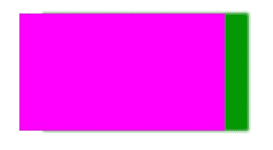

# HTML |画布阴影偏移属性

> 原文:[https://www . geesforgeks . org/html-canvas-shadowoffsetx-property/](https://www.geeksforgeeks.org/html-canvas-shadowoffsetx-property/)

**画布阴影偏移属性**用于**设置**或**返回**阴影与形状的*水平距离。此属性包含正值或负值，其中正值表示右侧的阴影，负值表示左侧的阴影。*

**语法:**

```html
context.shadowOffsetX=number
```

**属性值:**

*   **数字:**用于设置代表阴影水平距离的正数或负数。

**示例-1:**

```html
<!DOCTYPE html>
<html>

<head>
    <title>
        HTML canvas shadowOffsetX Property
    </title>
</head>

<body>
    <canvas id="GFG"
            width="500"
            height="300">
  </canvas>

    <script>
        var x = document.getElementById("GFG");
        var contex = x.getContext("2d");
        contex.shadowBlur = 20;

        // set horizontal distance.
        contex.shadowOffsetX = 40;
        contex.shadowColor = "blue";
        contex.fillStyle = "green";
        contex.fillRect(50, 50, 350, 200);
        contex.stroke();
    </script>

</body>

</html>
```

**输出:**


**示例-2:**

```html
<!DOCTYPE html>
<html>

<head>
    <title>
        HTML canvas shadowOffsetX Property
    </title>
</head>

<body>
    <canvas id="GFG"
            width="500"
            height="300">
  </canvas>

    <script>
        var x = 
            document.getElementById("GFG");
        var contex = x.getContext("2d");
        contex.shadowBlur = 5;
        contex.shadowOffsetX = 40;
        contex.shadowColor = "rgb(0, 153, 0)";
        contex.fillStyle = "rgb(255, 0, 255)";
        contex.fillRect(50, 50, 350, 200);
        contex.stroke();
    </script>

</body>

</html>
```

**输出:**


**支持的浏览器:**

*   谷歌 Chrome
*   Internet Explorer 9.0
*   火狐浏览器
*   旅行队
*   歌剧