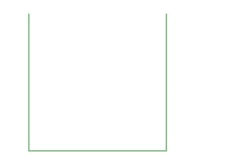

# HTML |画布笔画()方法

> 原文:[https://www.geeksforgeeks.org/html-canvas-stroke-method/](https://www.geeksforgeeks.org/html-canvas-stroke-method/)

**画布笔划()**方法用于*使用所有那些 **moveTo()** 和 **lineTo()** 方法*绘制您定义的路径。canvas stroke()方法的默认颜色是黑色。

**语法:**

```html
context.stroke()
```

**示例-1:**

## 超文本标记语言

```html
<!DOCTYPE html>
<html>

<head>
    <title>
        HTML canvas stroke() Method
    </title>
</head>

<body>
    <canvas id="GFG"
            width="500"
            height="300">
  </canvas>

    <script>
        var x =
            document.getElementById("GFG");
        var contex =
            x.getContext("2d");
        contex.rect(50, 50, 350, 200);
        contex.fillStyle = "green";
        contex.fill();

        // Draw the path
        contex.stroke();
    </script>

</body>

</html>
```

**输出:**


**示例-2:**

## 超文本标记语言

```html
<!DOCTYPE html>
<html>

<head>
    <title>
        HTML canvas stroke() Method
    </title>
</head>

<body>
    <canvas id="GFG"
            width="500"
            height="300">
  </canvas>

    <script>
        var x =
            document.getElementById("GFG");
        var contex =
            x.getContext("2d");
        contex.beginPath();
        contex.moveTo(50, 50);
        contex.lineTo(50, 250);
        contex.lineTo(250, 250);
        contex.lineTo(250, 50);
        contex.strokeStyle = "green";
        contex.stroke();
    </script>

</body>

</html>
```

**输出:**



**支持的浏览器:**

*   谷歌 Chrome
*   Internet Explorer 9.0
*   火狐浏览器
*   旅行队
*   歌剧