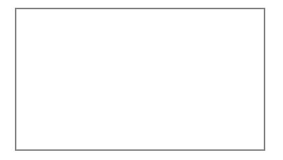
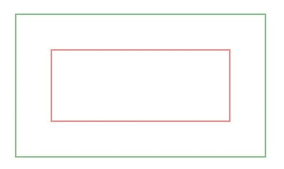

# HTML |画布 strokeRect()方法

> 原文:[https://www . geesforgeks . org/html-canvas-strokerect-method/](https://www.geeksforgeeks.org/html-canvas-strokerect-method/)

**strokeRect()方法**用于*绘制给定颜色的矩形*。笔画的默认颜色是黑色。

**语法:**

```html
context.strokeRect(x, y, width, height)
```

**参数:**

*   **x:** 存储矩形左上角的 x 坐标。
*   **y:** 存储矩形左上角的 y 坐标。
*   **宽度:**以像素为单位存储宽度。
*   **高度:**以像素为单位存储高度。

**示例-1:**

```html
<!DOCTYPE html>
<html>

<head>
    <title>
        HTML canvas strokeRect() Method
    </title>
</head>

<body>
    <canvas id="GFG"
            width="500" 
            height="300">
  </canvas>

    <script>
        var x =
            document.getElementById("GFG");
        var contex = x.getContext("2d");
        contex.strokeRect(50, 50, 350, 200);
        contex.stroke();
    </script>

</body>

</html>
```

**输出:**


**示例-2:**

```html
<!DOCTYPE html>
<html>

<head>
    <title>
        HTML canvas 
      strokeRect() Method
    </title>
</head>

<body>
    <canvas id="GFG" 
            width="500"
            height="300">
  </canvas>

    <script>
        var x =
            document.getElementById("GFG");
        var contex =
            x.getContext("2d");
        contex.strokeStyle = "green";
        contex.strokeRect(50, 50, 350, 200);

        contex.strokeStyle = "red";
        contex.strokeRect(100, 100, 250, 100);
        contex.stroke();
    </script>

</body>

</html>
```

**输出:**


**支持的浏览器:**

*   谷歌 Chrome
*   Internet Explorer 9.0
*   火狐浏览器
*   旅行队
*   歌剧