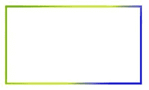

# HTML |画布 strokeStyle 属性

> 原文:[https://www . geesforgeks . org/html-canvas-strokestyle-property/](https://www.geeksforgeeks.org/html-canvas-strokestyle-property/)

canvas strokeStyle 属性用于设置或返回绘图中使用的颜色、渐变或图案的笔画。

**语法:**

```html
context.strokeStyle=color|gradient|pattern;
```

**属性值:**

*   **颜色:**用于设置绘图的填充颜色。画布填充样式属性的默认值是黑色。
*   **渐变:**用于设置渐变对象填充图形。渐变对象是线性或径向的。
*   **图案:**用于设置填充图纸的图案。

**示例 1:** 本示例使用 canvas strokeStyle 属性将笔画颜色设置为绿色。

```html
<!DOCTYPE html>
<html>

<head>
    <title>
        HTML canvas strokeStyle property
    </title>
</head>

<body>
    <canvas id="GFG" width="500" height="300"></canvas>

    <!-- Script to uses canvas strokeStyle property -->
    <script>
        var x = document.getElementById("GFG");
        var contex = x.getContext("2d");

        // Create rectangle
        contex.rect(50, 50, 350, 200);

        // Set stroke color
        contex.strokeStyle = "green";

        // Set stroke width
        contex.lineWidth = "10";

        contex.stroke();
    </script> 
</body>

</html>                    
```

**输出:**


**示例 2:** 本示例使用 canvas strokeStyle 属性使用线性渐变设置笔画颜色。

```html
<!DOCTYPE html>
<html>

<head>
    <title>
        HTML canvas strokeStyle property
    </title>
</head>

<body>
    <canvas id="GFG" width="500" height="300"></canvas>

    <!-- Script to uses canvas strokeStyle property -->    
    <script>
        var x = document.getElementById("GFG");
        var contex = x.getContext("2d");

        // Create linear gradient
        var gr = contex.createLinearGradient(0, 0, 350, 200);

        // Set color and position in a gradient object
        gr.addColorStop("0", "green");
        gr.addColorStop("0.7", "yellow");
        gr.addColorStop("1.0", "blue");

        // Set stroke style to gradient
        contex.strokeStyle = gr;

        // Set line width
        contex.lineWidth = 5;

        // Create rectangle
        contex.rect(50, 50, 350, 200);

        contex.stroke();
    </script> 
</body>

</html>                    
```

**输出:**


**支持的浏览器:**canvas strokeStyle 属性支持的浏览器如下:

*   谷歌 Chrome
*   Internet Explorer 9.0
*   火狐浏览器
*   旅行队
*   歌剧