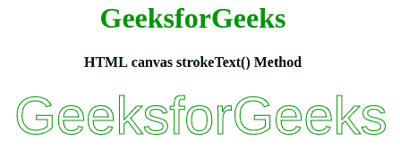
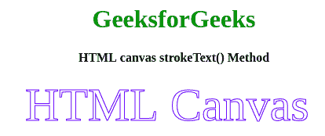

# HTML |画布 strokeText()方法

> 原文:[https://www . geesforgeks . org/html-canvas-stroketext-method/](https://www.geeksforgeeks.org/html-canvas-stroketext-method/)

我们可以使用 strokeText()方法在画布上绘制文本(没有填充)。基本上，通过这个方法，我们可以使用当前的字体、线宽和 strokeStyle 属性在指定的位置呈现指定的文本。文本的默认颜色是黑色。
**语法:**

```html
context.strokeText(text, x, y, maxWidth);

```

**参数值:**:该方法接受上面提到的、下面描述的四个参数:

*   **文本:**此参数指定将写在画布上的文本。
*   **x:** 该参数指定相对于画布开始绘制文本的水平坐标。
*   **y:** 此参数指定相对于画布开始绘制文本的垂直坐标。
*   **最大宽度:**此参数指定最大可能的文本宽度。

**实施例 1:** 以下实施例说明了 strokeTex()方法。

```html
<!DOCTYPE html>
<html>

<head>
    <title>
        HTML canvas strokeText() Method
    </title>
</head>

<body>
    <center>
        <h1 style="color:green"> 
        GeeksforGeeks 
    </h1>
        <h4> 
        HTML canvas strokeText() Method 
    </h4>
        <canvas id="GFG" width="500" height="200">
        </canvas>
        <script>
            var c = document.getElementById("GFG");
            var ctx = c.getContext("2d");
            ctx.font = "60px Arial";
            ctx.strokeStyle = "green";
            ctx.strokeText("GeeksforGeeks", 50, 50);
        </script>
    </center>
</body>

</html>
```

**输出:**


**例 2:**

```html
<!DOCTYPE html>
<html>

<head>
    <title>
        HTML canvas strokeText() Method
    </title>
</head>

<body>
    <center>
        <h1 style="color:green"> 
          GeeksforGeeks 
        </h1>
        <h4> 
          HTML canvas strokeText() Method 
        </h4>
        <canvas id="GFG" width="500" height="200">
        </canvas>
        <script>
            var c = document.getElementById("GFG");
            var ctx = c.getContext("2d");
            ctx.font = "60px Georgia";
            ctx.strokeStyle = "blue";
            ctx.strokeText("HTML Canvas", 60, 50);
        </script>
    </center>
</body>

</html>
```

**输出:**

**支持的浏览器:**HTML 画布 strokeText()方法支持的浏览器如下:

*   谷歌 Chrome
*   Internet Explorer 9.0
*   火狐浏览器
*   歌剧
*   旅行队