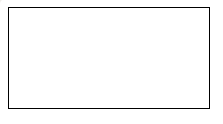
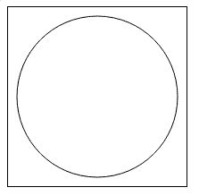
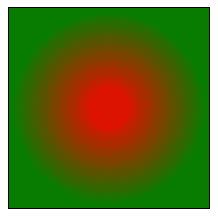

# HTML canvas 标签

> 原文:[https://www.geeksforgeeks.org/html-canvas-tag/](https://www.geeksforgeeks.org/html-canvas-tag/)

HTML 中的

<canvas>标记用于使用 JavaScript 在网页上绘制图形。它可以用来绘制路径、方框、文本、渐变和添加图像。默认情况下，它不包含边框和文本。</canvas>

**注意:**<画布>标签在 HTML5 中是新的。

**语法:**

```html
<canvas id = "script"> Contents... </canvas>
```

**属性:**标签接受两个属性，如上所述，如下所述。

*   [**高度**](https://www.geeksforgeeks.org/html-dom-style-height-property/) **:** 该属性用于设置画布的高度。
*   [**宽度**](https://www.geeksforgeeks.org/html-object-width-attribute/) **:此属性用于设置画布的宽度。**

**例 1:**

## 超文本标记语言

```html
<!DOCTYPE html>
<html>
    <body>

        <!-- canvas Tag starts here -->
        <canvas id = "GeeksforGeeks" width = "200" 
            height = "100" style = "border:1px solid black">
        </canvas>
        <!-- canvas Tag ends here -->

    </body>
</html>
```

**输出:**



**例 2:**

## 超文本标记语言

```html
<!DOCTYPE html>
<html>

    <body>
        <!-- HTML code to illustrate canvas tag -->
        <canvas id = "geeks" height = "200" width = "200"
            style = "border:1px solid black">
        </canvas>

        <script>
            var c = document.getElementById("geeks");
            var cx = c.getContext("2d");
            cx.beginPath();
            cx.arc(100, 100, 90, 0, 2 * Math.PI);
            cx.stroke();
        </script>

    </body>
</html>
```

**输出:**



**例 3:**

## 超文本标记语言

```html
<!DOCTYPE html>
<html>
    <body>

        <!-- canvas tag starts here -->
        <canvas id = "geeks" width = "200" height = "200"
            style = "border:1px solid black">
        </canvas>
        <!-- canvas tag ends here -->

        <script>
            var c=document.getElementById("geeks");
            var cx = c.getContext("2d");
            var grd = cx.createRadialGradient(100, 
                            100, 5, 100, 100, 100);
            grd.addColorStop(0, "red");
            grd.addColorStop(1, "green");
            cx.fillStyle = grd;
            cx.fillRect(0, 0, 200, 200);
        </script>

    </body>
</html>
```

**输出:**



**支持的浏览器:**

*   谷歌 Chrome 4.0
*   Internet Explorer 9.0
*   Firefox 2.0
*   Opera 9.0
*   Safari 3.1