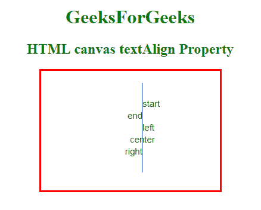

# HTML |画布文本对齐属性

> 原文:[https://www . geesforgeks . org/html-canvas-textalign-property/](https://www.geeksforgeeks.org/html-canvas-textalign-property/)

**HTML 画布文本对齐属性**用于**根据锚点设置**或**返回** *文本内容的当前对齐方式。基本上，文本将从该位置开始，文本将在该指定位置结束。*

**语法:**

```html
 context.textAlign="center | end | left | right | start"; 
```

**属性值:**

*   **开始:**有默认值。文本从指定位置开始。
*   **结束:**文本在指定位置结束。
*   **左侧:**用于将文本对齐设置为左侧。
*   **右:**用于将文本对齐设置为右对齐。
*   **居中:**用于将文本对齐设置为居中。

**示例:**

```html
<!DOCTYPE html>
<html>

<head>
    <style>
        h1,
        h2 {
            color: green;
        }

        body {
            text-align: center;
        }
    </style>
</head>

<body>
    <h1>GeeksForGeeks</h1>
    <h2>HTML canvas textAlign Property </h2>
    <canvas id="sudo"
            width="300" 
            height="200" 
            style="border:3px solid red;">
        Your browser does not support the HTML5 canvas tag.
  </canvas>

    <script>
        var c = document.getElementById("sudo");
        var ctx = c.getContext("2d");

        // Create a blue line in position 170
        ctx.strokeStyle = "blue";
        ctx.moveTo(170, 20);
        ctx.lineTo(170, 170);
        ctx.stroke();

        ctx.font = "15px Arial";

        // Show the different textAlign values
        ctx.textAlign = "start";
        ctx.fillText("start", 170, 60);
        ctx.textAlign = "end";
        ctx.fillText("end", 170, 80);
        ctx.textAlign = "left";
        ctx.fillText("left", 170, 100);
        ctx.textAlign = "center";
        ctx.fillText("center", 170, 120);
        ctx.textAlign = "right";
        ctx.fillText("right", 170, 140);
    </script>

</body>

</html>
```

**输出:**


**支持的浏览器:****HTML 画布 textAlign Property** 支持的浏览器如下:

*   谷歌 Chrome
*   Internet Explorer 9.0
*   火狐浏览器
*   苹果 Safari
*   歌剧