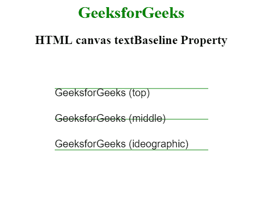
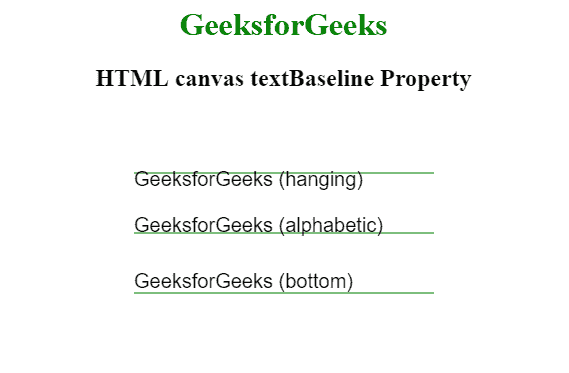

# HTML |画布文本基线属性

> 原文:[https://www . geesforgeks . org/html-canvas-text baseline-property/](https://www.geeksforgeeks.org/html-canvas-textbaseline-property/)

**HTML 画布文本基线属性**用于设置或返回当前文本的基线。此属性用于设置 HTML 中的字体基线对齐方式。基本上，此属性用于控制要在画布上绘制的文本的垂直对齐方式。

**语法:**

```html
context.textBaseline="alphabetic|top|hanging|middle|ideographic|bottom";
```

**属性值:**

*   **字母:**这是默认属性值。它指定文本基线是正常的字母基线。
*   **顶部:**该属性用于指定文本基线位于 em 正方形的顶部。
*   **悬挂:**此属性用于指定文本基线是悬挂基线。
*   **中间:**此属性用于指定文本基线是 em 正方形的中间。
*   **表意:**此属性用于指定文本基线是表意基线。
*   **底部:**此属性用于指定文本基线是边界框的底部。

**示例 1:** 本示例显示了顶部、中部和表意属性。

```html
<!DOCTYPE html>
<html>

<head> 
    <title> 
        HTML canvas textBaseline Property
    </title> 
</head> 

<body>
    <center> 
        <h1 style="color:green"> 
            GeeksforGeeks 
        </h1> 

        <h2>HTML canvas textBaseline Property</h2> 

        <canvas id="GFG" width="300" height="300">
        </canvas>

        <script>
            var doc_id = document.getElementById('GFG');
            var context = doc_id.getContext('2d');
            var b = ['top', 'middle', 'ideographic'];
            context.font = '20px Arial';
            context.strokeStyle = 'green';

            b.forEach(function (b, index) {
                context.textBaseline = b;
                var y = 60 + index * 60;
                context.beginPath();
                context.moveTo(0, y + 1);
                context.lineTo(550, y + 1);
                context.stroke();
                context.fillText('GeeksforGeeks (' + b + ')', 0, y);
            });
        </script>
    </center>
</body>

</html>             
```



**示例 2:** 本示例显示悬挂、字母和底部属性。

```html
<!DOCTYPE html>
<html>

<head> 
    <title> 
        HTML canvas textBaseline Property
    </title> 
</head> 

<body>
    <center> 
        <h1 style="color:green"> 
            GeeksforGeeks 
        </h1> 

        <h2>HTML canvas textBaseline Property</h2> 

        <canvas id="GFG" width="300" height="300">
        </canvas>

        <script>
            var doc_id = document.getElementById('GFG');
            var context = doc_id.getContext('2d');
            var b = ['hanging', 'alphabetic', 'bottom'];

            context.font = '20px Arial';
            context.strokeStyle = 'green';

            b.forEach(function (b, index) {
                context.textBaseline = b;
                var y = 60 + index * 60;
                context.beginPath();
                context.moveTo(0, y + 1);
                context.lineTo(550, y + 1);
                context.stroke();
                context.fillText('GeeksforGeeks (' + b + ')', 0, y);
            });
        </script>
    </center>
</body>

</html>          
```



**支持的浏览器:**HTML 画布 textBaseline 属性支持的浏览器如下:

*   谷歌 Chrome
*   Internet Explorer 9.0
*   火狐浏览器
*   歌剧
*   旅行队