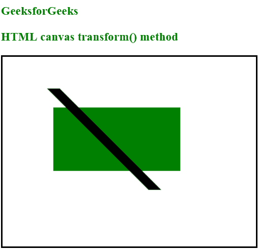

# HTML |画布变换()方法

> 原文:[https://www.geeksforgeeks.org/html-canvas-transform-method/](https://www.geeksforgeeks.org/html-canvas-transform-method/)

**变换()方法**用于替换当前变换矩阵，即画布上的每个对象都有一个当前变换矩阵。transform()方法用于将当前变换矩阵与下述矩阵相乘:

```html
a    c    e
b    d    f
0    0    1
```

它只允许缩放、移动、倾斜和旋转当前上下文。
**语法:**

```html
context.transform(a, b, c, d, e, f);
```

**参数值:**

*   a 表示水平缩放
*   b 表示水平偏斜
*   c 表示垂直偏斜
*   d 表示垂直缩放
*   e 表示水平移动
*   f 表示垂直移动

**示例:**

```html
<!DOCTYPE html>
<html>

<body>
    <h3 style="color:green"> 
      GeeksforGeeks
  </h3>
    <h3 style="color:green">
      HTML canvas transform() method
  </h3>
    <canvas id="gfgCanvas"
            width="400" 
            height="300" 
            style="border:2px solid ;">
    </canvas>

    <script>
        var gfg = document.getElementById("gfgCanvas");
        var context = gfg.getContext("2d");

        context.fillStyle = "green";
        context.fillRect(80, 80, 200, 100)

        context.transform(1, 0, 2, 2, 10, 10);
        context.fillStyle = "black";
        context.fillRect(20, 20, 20, 80);
    </script>

</body>

</html>
```

**输出:**


**支持的浏览器:**

*   铬
*   Mozilla Firefox
*   Internet Explorer 9.0
*   歌剧
*   旅行队