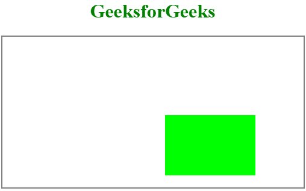
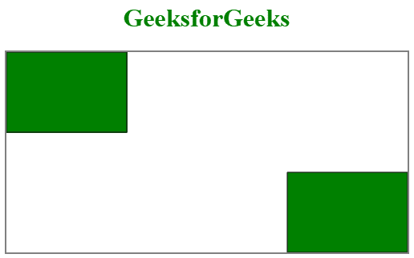

# HTML |画布翻译()方法

> 原文:[https://www.geeksforgeeks.org/html-canvas-translate-method/](https://www.geeksforgeeks.org/html-canvas-translate-method/)

HTML 画布 translate()方法用于指定按照给定的翻译量翻译对象。

**语法:**

```html
context.translate(x, y)
```

**参数值:**

*   **x:** 它存储的值是，画布向左或向右移动多少意味着 x 轴方向。
*   **y:** 它存储的值是，画布上下移动多少意味着 y 轴方向。

**例 1:** 这里可以通过改变 x 轴和 y 轴来检查。

```html
<!DOCTYPE html>
<html>

<head>
    <title>
        HTML canvas translate() Method
    </title>
</head>

<body>
    <center>
        <h1 style="color:green">GeeksforGeeks</h1>
        <canvas id="GFG" width="500" height="250" 
                     style="border:2px solid gray">
        </canvas>

        <script>
            var geeks = document.getElementById("GFG");
            var contex = geeks.getContext("2d");
            contex.translate(250, 110); //contex.translate(x, y);
            contex.fillStyle = "#00FF00";
            contex.fillRect(20, 20, 150, 100);
        </script>

    </center>
</body>

</html>
```

**输出:**

**例 2:**

```html
<!DOCTYPE html>
<html>

<head>
    <title>
        HTML canvas translate() Method
    </title>
</head>

<body>
    <center>
        <h1 style="color:green">GeeksforGeeks</h1>
        <canvas id="GFG" width="500" height="250" 
                style="border:2px solid gray">
        </canvas>

        <script>
            var geeks = document.getElementById("GFG");
            var contex = geeks.getContext("2d");
            contex.rect(00, 00, 150, 100);
            contex.fillStyle = "green";
            contex.fill();
            contex.stroke();

            contex.translate(250, 50);
            contex.rect(100, 100, 150, 100);
            contex.fillStyle = "";
            contex.fill();
            contex.stroke();
        </script>
    </center>
</body>

</html> 
```

**输出:**

**注意:**如果在 translate()方法之后调用 fillRect()方法，该值将被添加到 x 和 y 坐标值中。
**支持的浏览器:**

*   谷歌 Chrome
*   Internet Explorer 9.0 或更高版本
*   火狐浏览器
*   旅行队
*   歌剧