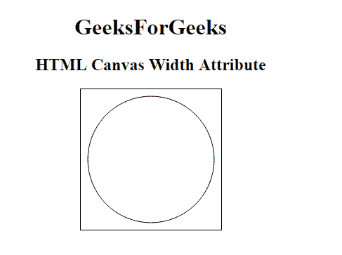

# HTML | canvas 宽度属性

> 原文:[https://www.geeksforgeeks.org/html-canvas-width-attribute/](https://www.geeksforgeeks.org/html-canvas-width-attribute/)

**HTML <画布>宽度属性**用于以像素为单位指定*画布<的宽度。*

**语法:**

```html
<canvas width="pixels"> 
```

**属性值:**它包含值，即**像素**，以像素为单位指定画布的宽度。它的默认值为 300。

**示例:**本示例说明了 Canvas Element 中宽度属性的使用。

```html
<!-- HTML code to illustrate 
width attribute of canvas tag -->
<!DOCTYPE html>
<html>

<head>
    <title>HTML canvas Width attribute</title>
</head>

<body style="text-align:center;">
    <h1>GeeksForGeeks</h1>
    <h2>HTML Canvas Width Attribute</h2>
    <canvas id="geeks" 
            height="200"
            width="200" 
            style="border:1px solid black">
    </canvas>

    <script>
        var c = document.getElementById("geeks");
        var cx = c.getContext("2d");
        cx.beginPath();
        cx.arc(100, 100, 90, 0, 2 * Math.PI);
        cx.stroke();
    </script>
</body>

</html>
```

**输出:**


**支持的浏览器:**

*   谷歌 Chrome 4.0
*   Firefox 2.0
*   Edge 9.0
*   Opera 9.0
*   苹果 Safari 3.1