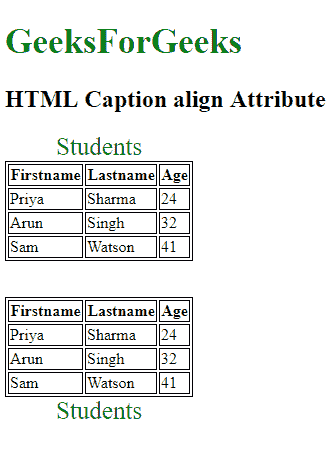

# HTML | caption 对齐属性

> 原文:[https://www.geeksforgeeks.org/html-caption-align-attribute/](https://www.geeksforgeeks.org/html-caption-align-attribute/)

**HTML <标题>对齐属性**用于指定 **<标题>** 元素的对齐。它用于将标题与表格的左、右、上、下对齐。
html 5 不支持该属性。

**语法:**

```html
<caption align="left | right | top | bottom> 
```

**属性值**

*   **左:**设置表格的左对齐标题。
*   **右:**设置表格的右对齐标题
*   **顶部:**设置表格的顶部对齐标题。
*   **底部:**设置表格的底部对齐标题。

**示例:**

```html
<!-- HTML code to show the working of caption tag -->
<!DOCTYPE html>
<html>

<head>
    <style>
        table,
        th,
        td {
            border: 1px solid black;
        }

        #GFG {
            font-size: 25px;
            color: green;
        }
    </style>
</head>

<body>
    <h1 style="color:green;font-size:35px;"> 
    GeeksForGeeks 
    </h1>
    <h2>HTML Caption align  Attribute</h2>

    <table>
        <!-- Adding caption to the table -->
        <caption id="GFG"
                 align="top">
          Students
      </caption>
        <tr>
            <th>Firstname</th>
            <th>Lastname</th>
            <th>Age</th>
        </tr>
        <tr>
            <td>Priya</td>
            <td>Sharma</td>
            <td>24</td>
        </tr>
        <tr>
            <td>Arun</td>
            <td>Singh</td>
            <td>32</td>
        </tr>
        <tr>
            <td>Sam</td>
            <td>Watson</td>
            <td>41</td>
        </tr>
    </table>
<br>
<br>
    <table>
        <!-- Adding caption to the table -->
        <caption id="GFG"
                 align="bottom">
          Students
      </caption>
        <tr>
            <th>Firstname</th>
            <th>Lastname</th>
            <th>Age</th>
        </tr>
        <tr>
            <td>Priya</td>
            <td>Sharma</td>
            <td>24</td>
        </tr>
        <tr>
            <td>Arun</td>
            <td>Singh</td>
            <td>32</td>
        </tr>
        <tr>
            <td>Sam</td>
            <td>Watson</td>
            <td>41</td>
        </tr>
    </table>
</body>

</html>
```

**输出:**


**支持的浏览器:**支持的浏览器 **HTML <标题>对齐属性**如下:

*   谷歌 Chrome
*   微软公司出品的 web 浏览器
*   火狐浏览器
*   苹果 Safari
*   歌剧