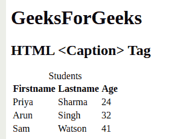
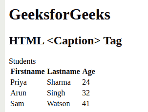

# HTML caption 标签

> 原文:[https://www.geeksforgeeks.org/html-caption-tag/](https://www.geeksforgeeks.org/html-caption-tag/)

**标题**标签用于指定表格的标题。该标签将被插入到<表格>标签之后。一个表格只能指定一个标题。默认情况下，它与中心对齐。

**语法:**

```html
<caption align = "value" ></caption>
```

**属性:**这个标签接受一个单一的属性，如上所述，如下所述。

*   [**对齐**](https://www.geeksforgeeks.org/html-align-attribute/) **:** 该属性是用来指定文字内容的对齐方式。

下面的例子说明了 HTML 中的标签:

**示例 1:** 向表格添加标题，即默认与中心对齐。

## 超文本标记语言

```html
<!DOCTYPE html> 
<html> 
<body> 
    <h1>GeeksForGeeks</h1> 
    <h2>HTML <Caption> Tag</h2> 

    <table> 
        <!-- Adding caption to the table -->
        <caption>Students</caption> 
        <tr> 
            <th>Firstname</th> 
            <th>Lastname</th> 
            <th>Age</th> 
        </tr> 
        <tr> 
            <td>Priya</td> 
            <td>Sharma</td> 
            <td>24</td> 
        </tr> 
        <tr> 
            <td>Arun</td> 
            <td>Singh</td> 
            <td>32</td> 
        </tr> 
        <tr> 
            <td>Sam</td> 
            <td>Watson</td> 
            <td>41</td> 
        </tr> 
    </table> 
</body> 
</html>
```

**输出:**



**示例 2:** 向表格中添加标题，并向其添加 align 属性，使标题向左对齐。

## 超文本标记语言

```html
<!DOCTYPE html>
<html>
  <body>
    <h1>GeeksforGeeks</h1>
    <h2>HTML <Caption> Tag</h2>

    <table>
      <!-- Adding a caption to the table 
            and aligning it to the left-->
      <caption style="text-align: left">
        Students
      </caption>
      <tr>
        <th>Firstname</th>
        <th>Lastname</th>
        <th>Age</th>
      </tr>
      <tr>
        <td>Priya</td>
        <td>Sharma</td>
        <td>24</td>
      </tr>
      <tr>
        <td>Arun</td>
        <td>Singh</td>
        <td>32</td>
      </tr>
      <tr>
        <td>Sam</td>
        <td>Watson</td>
        <td>41</td>
      </tr>
    </table>
  </body>
</html>
```

**输出:**



**支持的浏览器:**

*   谷歌 Chrome
*   微软公司出品的 web 浏览器
*   火狐浏览器
*   歌剧
*   旅行队