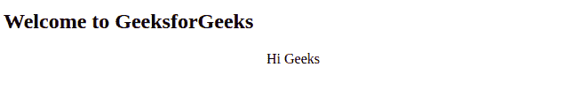
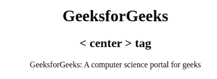
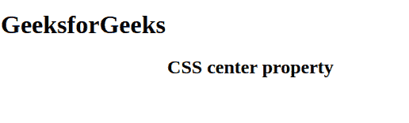

# HTML center 标签

> 原文:[https://www.geeksforgeeks.org/html-center-tag/](https://www.geeksforgeeks.org/html-center-tag/)

**示例:**在本例中，我们只是在 HTML 中心标签中使用了 Hi Geeks 内容。

## 超文本标记语言

```html
<!DOCTYPE html>
<html>

<body>
    <h2>Welcome to GeeksforGeeks</h2>
    <!--center tag is used here-->
    <center>Hi Geeks</center>

</body>

</html>
```

**输出:**



HTML 中的

<center>标签用于设置文本居中对齐。HTML5 中不支持此标记。CSS 的属性用于设置元素的对齐方式，而不是 HTML5 中的中心标记。</center>

**语法:**

```html
<center> Contents... </center>
```

**示例 1:** 这个示例说明了 HTML 中心标签。

## 超文本标记语言

```html
<!DOCTYPE html>
<html>
  <body>
    <!--center tag starts here -->
    <center>
      <h1>GeeksforGeeks</h1>
      <h2><center> tag</h2>
      <p>GeeksforGeeks: A computer science portal for geeks</p>

      <!--center tag ends here -->
    </center>
  </body>
</html>
```

**输出:**



**示例 2:** 使用 HTML5 中的 CSS 属性将文本对齐设置为居中。

## 超文本标记语言

```html
<!DOCTYPE html>
<html>
  <body>
    <h1>GeeksforGeeks</h1>
    <!--center using CSS style  -->
    <h2 style="text-align: center">
      CSS center property
    </h2>
  </body>
</html>
```

**输出:**



**支持的浏览器:**

*   谷歌 Chrome
*   微软 Edge 12 及以上版本
*   微软公司出品的 web 浏览器
*   火狐浏览器
*   歌剧
*   旅行队