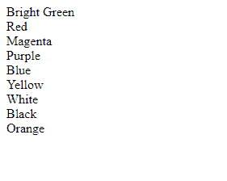
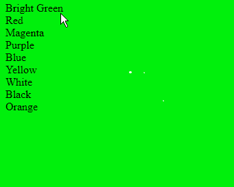
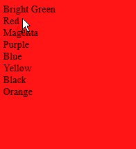
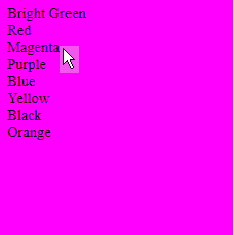
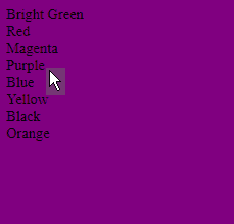
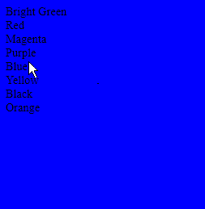
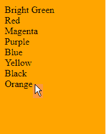
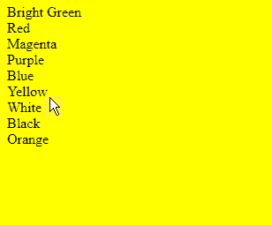

# HTML |使用 onmouseover 属性更改背景颜色

> 原文:[https://www . geesforgeks . org/html-change-background-color-using-onmouseover-property/](https://www.geeksforgeeks.org/html-change-background-color-using-onmouseover-property/)

在这篇文章中，onmouseover 事件的工作原理是通过将鼠标放在特定的颜色上来改变段落的颜色。

**语法:**

```html
document.bgColor = 'nameOfColor'

```

当鼠标移动到特定颜色时，改变背景颜色的 HTML 代码。背景颜色属性指定元素的背景颜色。

```html
<html>
  <p>
    <!-- when mouse is move over the colour name, colour change -->
    <a onmouseover="document.bgColor='greem'">Bright Green</a><br>
    <a onmouseover="document.bgColor='red'">Red</a><br>
    <a onmouseover="document.bgColor='magenta'">Magenta</a><br>
    <a onmouseover="document.bgColor='purple'">Purple</a><br>
    <a onmouseover="document.bgColor='blue'">Blue</a><br>
    <a onmouseover="document.bgColor='yellow'">Yellow</a><br>
    <a onmouseover="document.bgColor='black'">Black</a><br>
    <a onmouseover="document.bgColor='orange'">Orange</a><br>
  </p>
</html>
```

**输出:**
最初，背景颜色为白色-


当鼠标移过“亮绿色”颜色-


当鼠标移动到“红色”上时-


当鼠标移动到“洋红色”上时-


当鼠标移过“紫色”时-


当鼠标移动到“蓝色”上时-


当鼠标移动到“黑色”上时-


当鼠标移动到“橙色”上时-


当鼠标移动到“黄色”上时-
