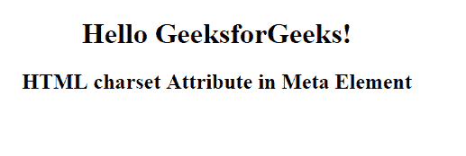

# HTML |字符集属性

> 原文:[https://www.geeksforgeeks.org/html-charset-attribute/](https://www.geeksforgeeks.org/html-charset-attribute/)

HTML 中的**字符集属性**用于定义字符编码。字符集属性与<元>和<脚本>元素一起使用。
**<元>标签中的字符集属性:**字符集属性存在于元元素中。它指定了 HTML 文档的字符编码。

**支持的标签:**

*   **< 当 >**
*   **<剧本>**

**语法:**

```html
<meta charset="character_set"> 
```

**属性值**:包含为 HTML 文档指定字符编码的值，即 character_set。

**值:**

*   UTF-8:它指定了 Unicode 的字符编码。
*   国际标准化组织 8859-1:它规定了拉丁字母的字符编码。

**示例:**这个示例说明了在元元素中使用 charset 属性。

## 超文本标记语言

```html
<!DOCTYPE html>
<html>
    <head>
        <title>
            HTML charset Attribute
        </title>

        <meta name="keywords" charset="UTF-8"
                content="Meta Tags, Metadata" />
    </head>

    <body style="text-align:center">
        <h1>Hello GeeksforGeeks!</h1>

        <h2>
            HTML charset Attribute in Meta Element
        </h2>
    </body>
</html>                   
```

**输出:**



**T2 脚本中的字符集属性>标记:**当字符集属性出现在脚本元素中时，它指定外部脚本中使用的字符编码。

**语法:**

```html
<script charset="charset">
```

**示例:**本示例说明了 charset 属性在脚本元素中的使用。

## 超文本标记语言

```html
<!DOCTYPE html>
<html>
    <head>
        <title>
            Charset Attribute script tag
        </title>

        <style>
            body {
                text-align:center;
            }
            h1 {
                color:green;
            }
        </style>
    </head>

    <body>
        <h1>GeeksforGeeks</h1>

        <h2>
            HTML charset Attribute in
            <script> Element
        </h2>

        <p id="Geeks"></p>

        <script charset="UTF-8">
            document.getElementById("Geeks").innerHTML
                    = "Hello GeeksforGeeks!";
        </script>
    </body>
</html>                   
```

**输出:**


**支持的浏览器:***HTML 字符集属性*支持的浏览器如下:

*   谷歌 Chrome
*   微软公司出品的 web 浏览器
*   火狐浏览器
*   歌剧
*   旅行队