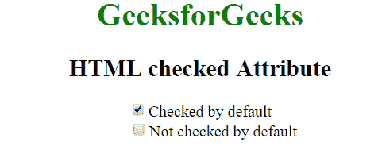
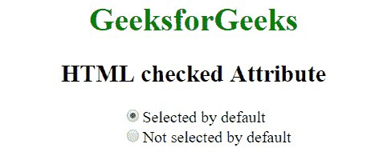

# HTML |勾选属性

> 原文:[https://www.geeksforgeeks.org/html-checked-attribute/](https://www.geeksforgeeks.org/html-checked-attribute/)

HTML 中的 checked 属性用于指示页面加载时是否应该检查元素。它是一个布尔属性。
**注意:**仅当类型为“复选框”或“单选”时，才能与<输入>元素一起使用。
**支持的标签:**

*   **<** [**输入>**](https://www.geeksforgeeks.org/html-inputchecked-attribute/?ref=rp)

**语法:**

```html
<input type = "checkbox|radio" checked>
```

**例 1:**

## 超文本标记语言

```html
<!DOCTYPE html>
<html>
    <head>
        <title>HTML checked Attribute</title>
    </head>
    <body style = "text-align: center;">
        <h1 style = "color: green;">GeeksforGeeks</h1>
        <h2>HTML checked Attribute</h2>
        <form >
            <!-- Below input elements have attribute "checked" -->
            <input type="checkbox" name="check" value="1" checked>
                                             Checked by default<br>
            <input type="checkbox" name="check" value="2">
                                  Not checked by default<br>
        </form>
    </body>
</html>                   
```

**输出:**



**例 2:**

## 超文本标记语言

```html
<!DOCTYPE html>
<html>
    <head>
        <title>HTML checked Attribute</title>
    </head>
    <body style = "text-align: center;">
        <h1 style = "color: green;">GeeksforGeeks</h1>
        <h2>HTML checked Attribute</h2>
        <form >
            <!-- Below input elements have attribute "checked" -->
            <input type="radio" name="check" value="1" checked>
                                         Selected by default<br>
            <input type="radio" name="check" value="2">
                              Not selected by default<br>
        </form>
    </body>
</html>                   
```

**输出:**



**支持的浏览器:**勾选属性的*支持的浏览器如下:* 

*   谷歌 Chrome 1.0
*   Internet Explorer 2.0
*   Firefox 1.0
*   Opera 1.0
*   苹果 Safari 1.0