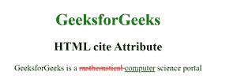

# HTML |引用属性

> 原文:[https://www.geeksforgeeks.org/html-cite-attribute/](https://www.geeksforgeeks.org/html-cite-attribute/)

**HTML 引用属性**用于指定文档的网址，该网址解释了描述文本插入原因的引号、消息或文本。
该属性可以和以下元素一起使用:

*   [HTML | <区块引用>引用属性](https://www.geeksforgeeks.org/html-blockquote-cite-attribute/)
*   [HTML | < del >引用属性](https://www.geeksforgeeks.org/html-del-cite-attribute/)
*   [HTML | < ins >引用属性](https://www.geeksforgeeks.org/html-ins-cite-attribute/)
*   [HTML | < q >引用属性](https://www.geeksforgeeks.org/html-q-cite-attribute/)

**属性值:**

*   **网址:它**包含指定报价来源的值，即**网址**。

**可能值**:

1.  **绝对 URL:它**指向另一个网站。
2.  **相对 URL:** 它指向网站内的一个文件。

以下示例说明了 HTML 中的引用属性:
**示例:**

## 超文本标记语言

```html
<!DOCTYPE html>
<html>

<head>
    <title>
        HTML cite Attribute
    </title>

    <style>
        del {
            color: red;
        }

        ins {
            color: green;
        }
    </style>
</head>

<body style="text-align:center;">

    <h1 style="color:green;">
        GeeksforGeeks
    </h1>

    <h2>
        HTML cite Attribute
    </h2>

<p>
        GeeksforGeeks is a
        <del id="GFG"
            cite="www.geeksforgeeks.org">
            mathematical
        </del>
        <ins> computer</ins> science portal
    </p>

</body>

</html>
```

**输出:**



**支持的浏览器:**HTML cite 属性支持的浏览器如下:

*   谷歌 Chrome
*   微软公司出品的 web 浏览器
*   火狐浏览器
*   歌剧
*   旅行队