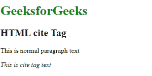

# HTML cite 标签

> 原文:[https://www.geeksforgeeks.org/html-cite-tag/](https://www.geeksforgeeks.org/html-cite-tag/)

HTML 中的<cite>标签用于定义作品的标题。HTML 4.1 中的<cite>标签定义引文，HTML5 中的<cite>标签定义作品标题。它以斜体格式显示文本。</cite></cite></cite>

**语法:**

```html
<cite> Title.. </cite>
```

**示例:**

## 超文本标记语言

```html
<!DOCTYPE html>
<html>

<body>
    <h1 style="color: green;">GeeksforGeeks</h1>

    <h2>HTML cite Tag</h2>

<p>This is normal paragraph text</p>

    <cite>This is cite tag text</cite>
</body>

</html>
```

**输出:**



**支持的浏览器:**

*   谷歌 Chrome
*   微软公司出品的 web 浏览器
*   火狐浏览器
*   歌剧
*   狩猎