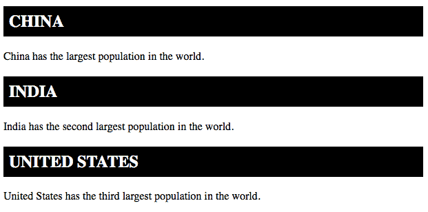
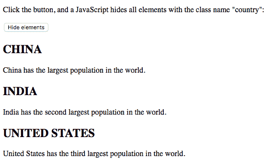
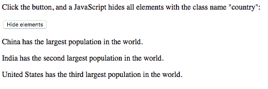
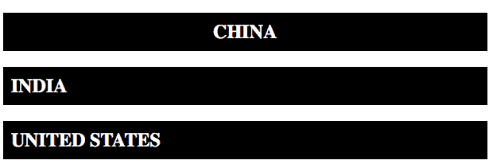
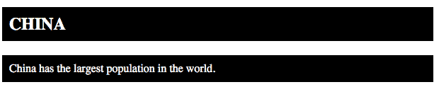

# HTML |类属性

> 原文:[https://www.geeksforgeeks.org/html-class-attribute/](https://www.geeksforgeeks.org/html-class-attribute/)

**html 中的类:**

*   类是一个属性，它为一个 HTML 元素指定一个或多个类名。
*   类属性可以用于任何 HTML 元素。
*   CSS 和 JavaScript 可以使用类名为具有指定类名的元素执行某些任务。

**支持的标签:支持所有 HTML 元素。**

**例:**

## 超文本标记语言

```html
<!DOCTYPE html>
<html>

<head>
    <style>
        .country {
            background-color: black;
            color: white;
            padding: 8px;
        }
    </style>
</head>

<body>

    <h2 class="country">CHINA</h2>

<p>China has the largest population
       in the world.</p>

    <h2 class="country">INDIA</h2>

<p>India has the second largest
       population in the world.</p>

    <h2 class="country">UNITED STATES</h2>

<p>United States has the third largest
       population in the world.</p>

</body>

</html>
```

**输出:**



**解释:**在上面的例子中，CSS 样式化了类名为“country”的所有元素。
**使用 JavaScript 中的 class 属性:** JavaScript 可以使用 getElementsByClassName()方法访问具有指定类名的元素。
**例:**

## 超文本标记语言

```html
<!DOCTYPE html>
<html>

<head>
    <script>
        function myFunction() {
            var x = document.getElementsByClassName("country");
            for (var i = 0; i < x.length; i++) {
                x[i].style.display = "none";
            }
        }
    </script>
</head>

<body>

<p>Click the button, and a JavaScript hides all
       elements with the class name "country":</p>

    <button onclick="myFunction()">Hide elements</button>

    <h2 class="country">CHINA</h2>

<p>China has the largest population in the world.</p>

    <h2 class="country">INDIA</h2>

<p>India has the second largest population in the world.</p>

    <h2 class="country">UNITED STATES</h2>

<p>United States has the third largest population
       in the world.</p>

</body>

</html>
```

**输出:**

*   点击隐藏元素按钮前:



*   点击隐藏元素按钮后:



**使用多个类:**
HTML 元素可以有多个类名，其中每个类名必须用空格隔开。
**例:**

## 超文本标记语言

```html
<!DOCTYPE html>
<html>
<style>
    .country {
        background-color: black;
        color: white;
        padding: 10px;
    }

    .middle {
        text-align: center;
    }
</style>

<body>

    <h2 class="country middle">CHINA</h2>
    <h2 class="country">INDIA</h2>
    <h2 class="country">UNITED STATES</h2>

</body>

</html>
```

**输出:**



**说明:**三个表头都有类名“country”，但除此之外，CHINA 还有类名“middle”，使得文本居中对齐。
**在不同的标签中使用相同的类:**不同的标签，如< h2 >和< p >，可以有相同的类名，从而共享相同的风格。
**例:**

## 超文本标记语言

```html
<!DOCTYPE html>
<html>
<style>
    .country {
        background-color: black;
        color: white;
        padding: 10px;
    }
</style>

<body>

    <h2 class="country">CHINA</h2>
    <p class="country">China has the largest
                population in the world.</p>

</body>

</html>
```

**输出:**



**说明:**即使两个元素没有相同的标签名，也可以有相同的类名，得到相同的样式。
**支持的浏览器:**类别属性支持的浏览器如下:

*   谷歌 Chrome
*   微软公司出品的 web 浏览器
*   火狐浏览器
*   歌剧
*   旅行队