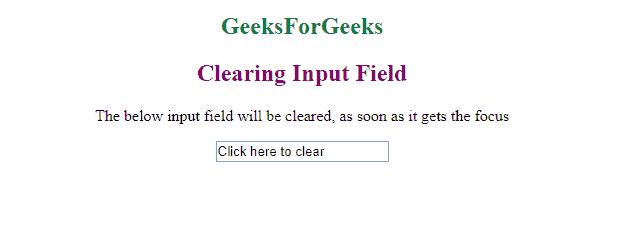
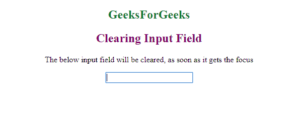
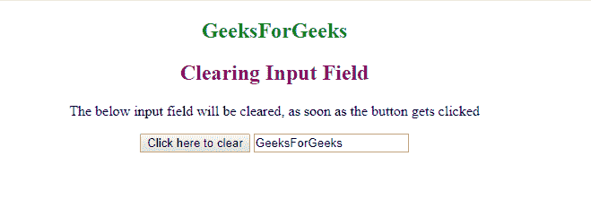
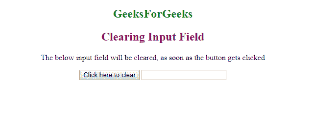

# HTML |清除输入字段

> 原文:[https://www . geesforgeks . org/html-清除输入字段/](https://www.geeksforgeeks.org/html-clearing-the-input-field/)

清除整个输入字段，而不必手动删除整个内容，或者如果输入字段中已经存在用户不想要的预先建议的输入，该怎么办。可能有很多情况。因此，在本文中，我们将学习如何清除输入字段。

有两种方法可以做到这一点，而且都非常简单和简短。让我们看看他们两个。

**方法 1:** 清除焦点输入。

**语法:**

```html
<input onfocus=this.value=''>
```

**进场:**

*   创建一个输入字段。
*   使用 **this.value** 将 **onfocus** 属性设置为 *NULL*

**示例:**

```html
<!DOCTYPE html>
<html>

<body>

    <body style="text-align:center">
        <h2 style="color:green">GeeksForGeeks</h2>
        <h2 style="color:purple">Clearing Input Field</h2>
        <p>The below input field will be cleared, as soon as it gets the focus</p>
        <input type="text" onfocus="this.value=''" value="Click here to clear">
    </body>

</html>
```

**输出:**
**前:**


**之后:**


**方法二:**借助按钮清除输入。

**语法:**

```html
<button onclick="document.getElementById('InputID').value = ''>
```

**进场:**

*   创建一个**按钮**。
*   获取输入字段的 **id** 。
*   使用**文档. getElementById('myInput ')将输入字段的值*设置为空*。value =**

```html
<!DOCTYPE html>
<html>

<body style="text-align:center">
    <h2 style="color:green">
          GeeksForGeeks
      </h2>
    <h2 style="color:purple">
      Clearing Input Field
  </h2>
    <p>The below input field will be
      cleared, as soon as the button
      gets clicked
  </p>
    <button onclick=
            "document.getElementById(
             'myInput').value = ''">
      Click here to clear
  </button>
    <input type="text" 
           value="GeeksForGeeks" 
           id="myInput">
</body>

</html>
```

**输出:**
**前:**


**之后:**


HTML 是网页的基础，通过构建网站和网络应用程序用于网页开发。您可以通过以下 [HTML 教程](https://www.geeksforgeeks.org/html-tutorials/)和 [HTML 示例](https://www.geeksforgeeks.org/html-examples/)从头开始学习 HTML。