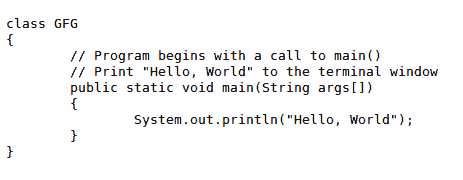

# HTML code Tag

> 原文:[https://www.geeksforgeeks.org/html-code-tag/](https://www.geeksforgeeks.org/html-code-tag/)

HTML 中的`标记用于定义计算机代码。在创建网页的过程中，有时需要显示计算机编程代码。它可以通过 HTML 的任何基本标题标签来完成，但是 HTML 提供了一个单独的标签`。``

代码标签是一种表示计算机输出的特定类型的文本。HTML 提供了许多文本格式化的方法，但是`标签是以固定的字母大小、字体和间距显示的。`

**关于<代码>的几点标注:**

*   它主要用于将代码片段显示到 web 浏览器中。
*   此标签设置其元素的样式，以匹配计算机的默认文本格式。
*   默认情况下，web 浏览器使用等间距字体系列来显示< code< tags 元素内容。

**语法:**

```html
<code> Contents... </code>
```

下面的例子说明了 HTML 代码标签。

**例 1:**

## 超文本标记语言

```html
<!DOCTYPE html>
<html>

<body>
    <pre>
<!--code Tag starts here -->
      <code>
#include<stdio.h>
int main() {
    printf("Hello Geeks");
}
<!--code Tag starts here -->
      </code>
    </pre>
</body>

</html>
```

**输出:**


**例 2:**

## 超文本标记语言

```html
<!DOCTYPE html>
<html>

<body>
    <pre>
<!--code Tag starts here -->
        <code>
        class GFG
        {
            // Program begins with a call to main()
            // Print "Hello, World" to the terminal window
            public static void main(String args[])
            {
                System.out.println("Hello, World");
            }
        }
<!--code Tag ends here -->
        </code>
     </pre>

</body>

</html>
```

**输出:**写在<代码>标签里面的程序，和基本的标题标签、段落标签有一些不同的字体大小和字体类型。



**注意:** < pre >标记用于显示代码片段，因为它总是保持文本格式不变。
**支持的浏览器:**

*   谷歌 Chrome
*   微软公司出品的 web 浏览器
*   火狐浏览器
*   歌剧
*   旅行队