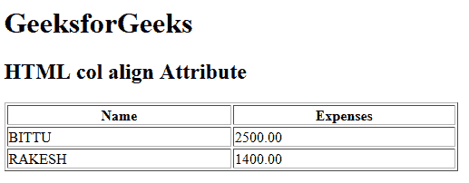

# HTML | 对齐属性

> 原文:[https://www.geeksforgeeks.org/html-col-align-attribute/](https://www.geeksforgeeks.org/html-col-align-attribute/)

**HTML <栏>对齐属性**用于*设置栏元素*内文本内容的水平对齐。HTML 5 不支持。

**语法:**

```html
<col align="left | right | center | justify | char">
```

**属性值:**

*   **左:**设置文本左对齐。
*   **右:**设置文本右对齐。
*   **居中:**设置文本居中对齐。
*   **对齐:**拉伸段落文本，使所有行的宽度相等。
*   **字符:**它将文本对齐设置为特定字符。

**示例:**

```html
<!DOCTYPE html>
<html>

<head>
    <title>
      HTML col align Attribute
  </title>
</head>

<body>
    <h1>GeeksforGeeks</h1>

    <h2>
      HTML col align Attribute
  </h2>

    <table width="500" border="1">
        <col align="center">
            <col align="center">

                <tr>
                    <th>Name</th>
                    <th>Expenses</th>
                </tr>

                <tr>
                    <td>BITTU</td>
                    <td>2500.00</td>
                </tr>

                <tr>
                    <td>RAKESH</td>
                    <td>1400.00</td>
                </tr>
    </table>
</body>

</html>
```

**输出:**


**支持的浏览器:**以下列出了 **HTML < col > align 属性**支持的浏览器:

*   谷歌浏览器:不支持
*   互联网浏览器:不支持
*   火狐:不支持
*   Safari:不支持
*   歌剧:不支持