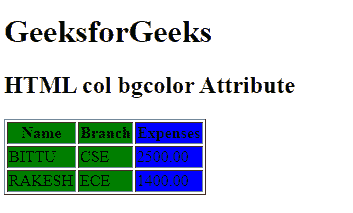

# HTML | bgcolor 属性

> 原文:[https://www.geeksforgeeks.org/html-col-bgcolor-attribute/](https://www.geeksforgeeks.org/html-col-bgcolor-attribute/)

**HTML < col > bgcolor 属性**用于指定列元素的背景颜色。HTML 5 不支持。

**语法:**

```html
<col bgcolor= "color_name | hex_number | rgb_number">
```

**属性值:**

*   **color_name:** 使用颜色名称设置文本颜色。例如*【红色】*。
*   **十六进制数:**使用颜色十六进制码设置文本颜色。例如*“# 0000 ff”*。
*   **rgb_number:** 使用 rgb 代码设置文本颜色。例如:*“RGB(0，153，0)”*。

**示例:**

```html
<!DOCTYPE html>
<html>

<head>
    <title>
        HTML col bgcolor Attribute
    </title>
</head>

<body>
    <h1>GeeksforGeeks</h1>

    <h2>HTML col bgcolor Attribute</h2>

    <table border="1">
        <colgroup>
            <col span="2" bgcolor="green">
                <col bgcolor="blue">
        </colgroup>
        <tr>
            <th>Name</th>
            <th>Branch</th>
            <th>Expenses</th>
        </tr>

        <tr>
            <td>BITTU</td>
            <td>CSE</td>
            <td>2500.00</td>
        </tr>

        <tr>
            <td>RAKESH</td>
            <td>ECE</td>
            <td>1400.00</td>
        </tr>
    </table>
</body>

</html>
```

**输出:**


**支持的浏览器:**T2 HTML<col>bgcolor 属性支持的浏览器如下:

*   谷歌 Chrome
*   微软公司出品的 web 浏览器
*   火狐浏览器
*   旅行队
*   歌剧