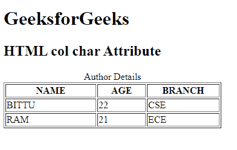

# HTML | 字符属性

> 原文:[https://www.geeksforgeeks.org/html-col-char-attribute/](https://www.geeksforgeeks.org/html-col-char-attribute/)

**HTML <栏>字符属性**用于设置字符中一列内容的对齐方式。仅当 align 属性设置为“字符”时，才能使用它。char 的默认值是页面语言的小数点字符。

**语法:**

```html
<col char="character">
```

**属性值:**

*   **字符:**指定内容与字符的对齐方式。

**注意:**HTML 5 不支持。使用 CSS 属性代替该属性。

**示例:**

```html
<!DOCTYPE html> 
<html> 

<head> 
    <title> 
        HTML col char Attribute 
    </title> 
</head> 

<body> 
    <h1>GeeksforGeeks</h1> 

    <h2>HTML col char Attribute</h2> 

    <table border="1"> 
        <caption>Author Details</caption> 

        <col width="150" align="char" char="." > 
        <col width="80" align="char" char="."> 
        <col width="120" align="char" char="."> 

        <tr> 
            <th>NAME</th> 
            <th>AGE</th> 
            <th>BRANCH</th> 
        </tr> 
        <tr> 
            <td>BITTU</td> 
            <td>22</td> 
            <td>CSE</td> 
        </tr> 
        <tr> 
            <td>RAM</td> 
            <td>21</td> 
            <td>ECE</td> 
        </tr> 
    </table> 
</body> 

</html>
```

**输出:**


**支持的浏览器:**任何主要浏览器都不支持。