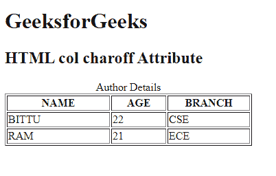

# HTML | charoff 属性

> 原文:[https://www.geeksforgeeks.org/html-col-charoff-attribute/](https://www.geeksforgeeks.org/html-col-charoff-attribute/)

**HTML <栏> charoff 属性**用于设置与 char 属性指定的字符对齐的字符数。该属性只能在 char 属性中使用，align 属性在<栏>元素中指定。

**语法:**

```html
<col charoff="number">
```

**属性值:**它包含单个值**数字**，该数字代表指定路线的数值。

*   **正值:**表示字符向右对齐。
*   **负值:**表示字符向左对齐。

**注意:**HTML 5 不支持该属性。

**示例:**

```html
<!DOCTYPE html> 
<html> 

<head> 
    <title> 
        HTML col charoff Attribute 
    </title> 
</head> 

<body> 
    <h1>GeeksforGeeks</h1> 

    <h2>HTML col charoff Attribute</h2> 

    <table border="1"> 
        <caption>Author Details</caption> 

        <col width="150" align="char" char="."
                    valign="top" charoff ="3"> 
        <col width="80" align="char" char="." 
                    valign="top" charoff ="3"> 
        <col width="120" align="char" char="."
                    valign="top"> 

        <tr> 
            <th>NAME</th> 
            <th>AGE</th> 
            <th>BRANCH</th> 
        </tr> 
        <tr> 
            <td>BITTU</td> 
            <td>22</td> 
            <td>CSE</td> 
        </tr> 
        <tr> 
            <td>RAM</td> 
            <td>21</td> 
            <td>ECE</td> 
        </tr> 
    </table> 
</body> 

</html>
```

**输出:**


**支持的浏览器:**任何浏览器都不支持该属性。