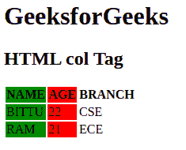

# HTML 标签

> 原文:[https://www.geeksforgeeks.org/html-col-tag/](https://www.geeksforgeeks.org/html-col-tag/)

HTML 中的标签用于设置 [<列组>](https://www.geeksforgeeks.org/html-colgroup-tag/) 标签内每一列的列属性。此标记用于为每一列设置 style 属性。此标记不包含结束标记。

**语法:**

```html
<col attribute = "value">
```

**属性:**可以与 col 标签一起使用的各种属性如下。HTML5 不支持大多数属性。

*   [**跨度**](https://www.geeksforgeeks.org/span-tag-html/) **:** 用于定义应用属性的列数。
*   [**样式**](https://www.geeksforgeeks.org/html-style-attribute/) **:** 该属性用于定义 CSS 改变列的属性。
*   [**对齐**](https://www.geeksforgeeks.org/html-align-attribute/) **:** 该属性用于设置< col >元素内容的对齐。
*   [**宽度**](https://www.geeksforgeeks.org/html-table-width-attribute/) **:用于指定< col >元素的宽度。**
*   [](https://www.geeksforgeeks.org/html-tr-charoff-attribute/)****:**用于指定内容将与字符属性指定的字符对齐的字符数。**

****示例:**下面的示例解释了 HTML col Tag。**

## **超文本标记语言**

```html
<!DOCTYPE html>
<html>
  <body>
    <h1>GeeksforGeeks</h1>
    <h2>HTML col Tag</h2>
    <table>
      <colgroup>
        <!-- col tag starts from here -->
        <col span="1" style="background-color: green" />
        <col span="1" style="background-color: red" />
        <col span="1" style="background-color: none" />
        <!-- col tag ends here. col tag does not 
                contains ending tag -->
      </colgroup>

      <tr>
        <th>NAME</th>
        <th>AGE</th>
        <th>BRANCH</th>
      </tr>
      <tr>
        <td>BITTU</td>
        <td>22</td>
        <td>CSE</td>
      </tr>
      <tr>
        <td>RAM</td>
        <td>21</td>
        <td>ECE</td>
      </tr>
    </table>
  </body>
</html>
```

****输出:****

****

****支持的浏览器:****

*   **谷歌 Chrome**
*   **微软公司出品的 web 浏览器**
*   **火狐浏览器**
*   **歌剧**
*   **旅行队**