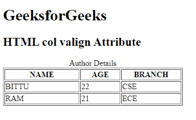

# HTML | valign 属性

> 原文:[https://www.geeksforgeeks.org/html-col-valign-attribute/](https://www.geeksforgeeks.org/html-col-valign-attribute/)

**HTML <列> valign 属性**用于指定列元素中文本内容的垂直对齐方式。

**语法:**

```html
<col valign="top | middle | bottom | baseline">
```

**属性值:**

*   **顶部:**将内容设置为顶部对齐。
*   **中:**将内容设置为中对齐。
*   **底部:**将内容设置为底部对齐。
*   **基线:**设置内容为基线。基线是大多数角色所处的位置。

**示例:**

```html
<!DOCTYPE html> 
<html> 

<head> 
    <title> 
        HTML col valign Attribute 
    </title> 
</head> 

<body> 
    <h1>GeeksforGeeks</h1> 

    <h2>HTML col valign Attribute</h2> 

    <table border="1"> 
        <caption>Author Details</caption> 

        <col width="150" align="char"
                    char="." valign="top"> 
        <col width="80" align="char"
                    char="." valign="top"> 
        <col width="120" align="char"
                    char="." valign="top"> 

        <tr> 
            <th>NAME</th> 
            <th>AGE</th> 
            <th>BRANCH</th> 
        </tr> 
        <tr> 
            <td>BITTU</td> 
            <td>22</td> 
            <td>CSE</td> 
        </tr> 
        <tr> 
            <td>RAM</td> 
            <td>21</td> 
            <td>ECE</td> 
        </tr> 
    </table> 
</body> 

</html>
```

**输出:**


**支持的浏览器:**仅 Internet Explorer 和 Opera 12 及更早版本支持此属性。