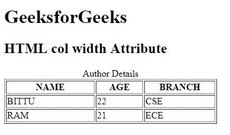

# HTML | 宽度属性

> 原文:[https://www.geeksforgeeks.org/html-col-width-attribute/](https://www.geeksforgeeks.org/html-col-width-attribute/)

**HTML <栏>宽度属性**用于*指定<栏>元素*的宽度。它设置列元素的固定宽度。一般来说，<栏>元素的宽度是显示其内容所需的宽度。

**语法:**

```html
<col width="pixels | % | relative_length">
```

**属性值:**

*   **像素:**以像素为单位设置<栏>属性的宽度。
*   **%:** 以百分比(%)设置<栏>属性的宽度。
*   **relative_length:** 设置<栏>元素属性相对于其其他内容的宽度。

**注意:**HTML 5 不支持<栏>宽度属性。

**示例:**

```html
<!DOCTYPE html>
<html>

<head>
    <title>
        HTML col width Attribute
    </title>
</head>

<body>
    <h1>GeeksforGeeks</h1>

    <h2>HTML col width Attribute</h2>

    <table border="1">
        <caption>Author Details</caption>

        <col width="150">
            <col width="80">
                <col width="120">
                    <tr>
                        <th>NAME</th>
                        <th>AGE</th>
                        <th>BRANCH</th>
                    </tr>
                    <tr>
                        <td>BITTU</td>
                        <td>22</td>
                        <td>CSE</td>
                    </tr>
                    <tr>
                        <td>RAM</td>
                        <td>21</td>
                        <td>ECE</td>
                    </tr>
    </table>
</body>

</html>
```

**输出:**


**支持的浏览器:**支持的浏览器 **HTML < col >宽度属性**如下:

*   谷歌 Chrome
*   微软公司出品的 web 浏览器
*   火狐浏览器
*   旅行队
*   歌剧