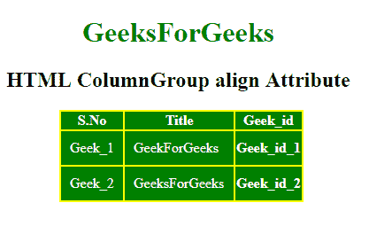

# HTML | colgroup 对齐属性

> 原文:[https://www . geesforgeks . org/html-col group-align-attribute/](https://www.geeksforgeeks.org/html-colgroup-align-attribute/)

**HTML <列组>对齐属性**用于设置列组中文本或内容的水平对齐。

**语法:**

```html
<colgroup align="left|right|center|justify|char>
```

**属性值:**

*   **左:**将内容设置为左对齐。
*   **右:**将内容设置为右对齐。
*   **居中:**它将内容设置为居中。
*   **正名:**拉长线条，平分内容。
*   **char:** 它将内容设置为特定的字符。

**示例:**

```html
<!DOCTYPE html> 
<html> 

<head> 
    <title> 
        HTML ColumnGroup align Attribute 
    </title> 

    <style> 
        #myColGroup { 
            background: green; 
        } 

        table { 
            color: white; 
            margin-left: 180px; 
            background: yellow; 
        } 

        #Geek_p { 
            color: green; 
            font-size: 30px; 
        } 

        td { 
            padding: 10px; 
        } 
        h1, h2 {
            text-align:center;
        }
    </style> 
</head> 

<body> 

    <h1 style="color:green;"> 
        GeeksForGeeks 
    </h1> 

    <h2> 
        HTML ColumnGroup align Attribute 
    </h2> 

    <table> 
        <colgroup id="myColGroup" span="3" align = "left"> 
        </colgroup> 

        <tr> 
            <th>S.No</th> 
            <th>Title</th> 
            <th>Geek_id</th> 
        </tr> 
        <tr> 
            <td>Geek_1</td> 
            <td>GeekForGeeks</td> 
            <th>Geek_id_1</th> 
        </tr> 
        <tr> 
            <td>Geek_2</td> 
            <td>GeeksForGeeks</td> 
            <th>Geek_id_2</th> 
        </tr> 
    </table> 
</body> 

</html>
```

**输出:**


**支持的浏览器:**任何浏览器都不支持< colgroup > align 属性。现在用 CSS 代替。