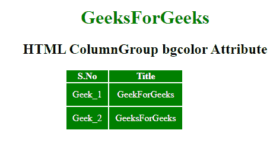

# HTML | colgroup bgcolor 属性T3】

> 原文:[https://www . geesforgeks . org/html-col group-bgcolor-attribute/](https://www.geeksforgeeks.org/html-colgroup-bgcolor-attribute/)

**HTML < colgroup > bgcolor 属性**用于指定 colgroup 元素的背景颜色。HTML 5 不支持。

**语法:**

```html
<colgroup bgcolor= "color_name | hex_number | rgb_number">
```

**属性值:**

*   **color_name:** 使用颜色名称设置文本颜色。例如*【红色】*。
*   **十六进制数:**使用颜色十六进制码设置文本颜色。例如*“# 0000 ff”*。
*   **rgb_number:** 使用 rgb 代码设置文本颜色。例如:*“RGB(0，153，0)”*。

**示例:**

```html
<!DOCTYPE html>
<html>

<head>
    <title>
        HTML colgroup bgcolor Attribute
    </title>

    <style>
        table {
            color: white;
            margin-left: 180px;
        }

        td {
            padding: 10px;
        }
    </style>
</head>

<body style="text-align:center;">

    <h1 style="color:green;"> 
        GeeksForGeeks 
    </h1>

    <h2> 
        HTML ColumnGroup bgcolor Attribute 
    </h2>

    <table>
        <colgroup id="myColGroup"
                  span="2"
                  bgcolor="green">
        </colgroup>
        <tr>
            <th>S.No</th>
            <th>Title</th>
            <th>Geek_id</th>
        </tr>
        <tr>
            <td>Geek_1</td>
            <td>GeekForGeeks</td>
            <th>Geek_id_1</th>
        </tr>
        <tr>
            <td>Geek_2</td>
            <td>GeeksForGeeks</td>
            <th>Geek_id_2</th>
        </tr>
    </table>
</body>

</html>
```

**输出:**


**支持的浏览器:**以下列出了 **HTML < colgroup > bgcolor 属性**支持的浏览器:

*   谷歌 Chrome
*   微软公司出品的 web 浏览器
*   火狐浏览器
*   旅行队
*   歌剧