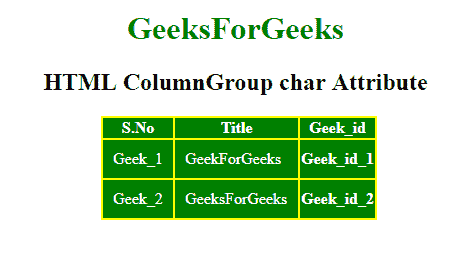

# HTML |字符属性

> 原文:[https://www.geeksforgeeks.org/html-colgroup-char-attribute/](https://www.geeksforgeeks.org/html-colgroup-char-attribute/)

**HTML <列组>字符属性**用于设置一个字符中列组内容的对齐方式。仅当 align 属性设置为“字符”时，才能使用它。char 的缺省值是页面语言的小数点字符。
**语法:**

```html
<colgroup char="character">
```

**属性值:**

*   **字符:**指定内容与字符的对齐方式。

**例:**

## 超文本标记语言

```html
<!DOCTYPE html>
<html>

<head>
    <title>
        HTML ColumnGroup char Attribute
    </title>

    <style>
        #myColGroup {
            background: green;
        }

        table {
            color: white;
            margin-left: 180px;
            background: yellow;
        }

        #Geek_p {
            color: green;
            font-size: 30px;
        }

        td {
            padding: 10px;
        }

        h1,
        h2 {
            text-align: center;
        }
    </style>
</head>

<body>

    <h1 style="color:green;">
        GeeksForGeeks
    </h1>

    <h2>
        HTML ColumnGroup char Attribute
    </h2>

    <table>
        <colgroup id="myColGroup"
                  span="3"
                  align="char"
                  char=".">
        </colgroup>

        <tr>
            <th>S.No</th>
            <th>Title</th>
            <th>Geek_id</th>
        </tr>
        <tr>
            <td>Geek_1</td>
            <td>GeekForGeeks</td>
            <th>Geek_id_1</th>
        </tr>
        <tr>
            <td>Geek_2</td>
            <td>GeeksForGeeks</td>
            <th>Geek_id_2</th>
        </tr>
    </table>
</body>

</html>
```

**输出:**



**支持的浏览器:**没有主要浏览器支持 **< colgroup > char 属性。**