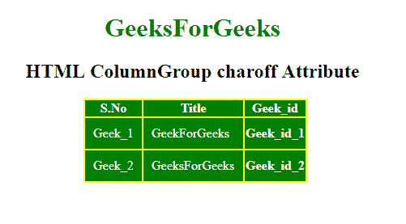

# HTML | colgroup charoff 属性

> 原文:[https://www . geesforgeks . org/html-col group-charoff-attribute/](https://www.geeksforgeeks.org/html-colgroup-charoff-attribute/)

**HTML <列组>字符属性**用于设置与字符属性指定的字符对齐的字符数。此属性只能在字符属性中使用，并且在列组元素中指定了对齐属性。

**语法:**

```html
<colgroup charoff="number">
```

**属性值:**

*   **数字:**包含指定对齐方式的数值。
    1.  正值表示字符向右对齐。
    2.  Negative values indicate the alignment to the left of the characters.

        **示例:**

        ```html
        <!DOCTYPE html>
        <html>

        <head>
            <title>
                HTML ColumnGroup charoff Attribute
            </title>

            <style>
                #myColGroup {
                    background: green;
                }

                table {
                    color: white;
                    margin-left: 180px;
                    background: yellow;
                }

                #Geek_p {
                    color: green;
                    font-size: 30px;
                }

                td {
                    padding: 10px;
                }

                h1,
                h2 {
                    text-align: center;
                }
            </style>
        </head>

        <body>

            <h1 style="color:green;"> 
                GeeksForGeeks 
            </h1>

            <h2> 
                HTML ColumnGroup charoff Attribute 
            </h2>

            <table>
                <colgroup id="myColGroup" 
                          span="3"
                          align="char" 
                          char="." 
                          charoff="3">
                </colgroup>

                <tr>
                    <th>S.No</th>
                    <th>Title</th>
                    <th>Geek_id</th>
                </tr>
                <tr>
                    <td>Geek_1</td>
                    <td>GeekForGeeks</td>
                    <th>Geek_id_1</th>
                </tr>
                <tr>
                    <td>Geek_2</td>
                    <td>GeeksForGeeks</td>
                    <th>Geek_id_2</th>
                </tr>
            </table>
        </body>

        </html>
        ```

        **输出:**
        

        **支持的浏览器:**支持的浏览器 **HTML < colgroup > charoff 属性**如下:

        *   **谷歌浏览器** *不支持*
        *   **不支持互联网浏览器**
        *   ***火狐** *不支持**
        *   ***苹果 Safari** *不支持**
        *   ***歌剧** *不支持**